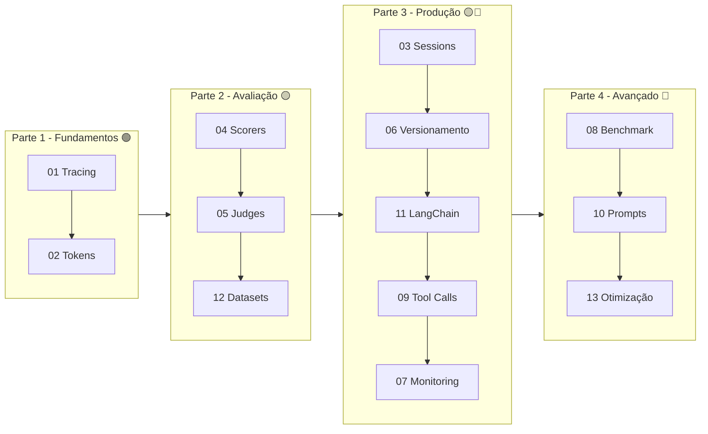

# ia-observability

[](https://docs.python.org/pt-br/3.14/)
[](https://mlflow.org/docs/latest/genai/)
[](https://mlflow.org/docs/latest/genai/tracing/)

Projeto **didatico** de observabilidade e benchmark de LLM usando [MLflow GenAI](https://mlflow.org/docs/latest/genai/).

Cada modulo e um exemplo **autocontido** de uma funcionalidade do MLflow, do basico (tracing) ao avancado (otimizacao de prompts). Os modelos sao servidos pelo **MLflow AI Gateway** (endpoint compativel com OpenAI).

## Documentacao

- 📖 [Como usar](docs/como-usar.md) — setup, `.env`, rodar as demos e ver no MLflow UI.
- 🎓 [Workshop de Observabilidade em IA](docs/workshop-observabilidade-ia.md) — material de apresentacao (1h) com os conceitos por tras das demos.

## Por que observabilidade em IA?

LLMs sao **nao-deterministicos**, **caixa-preta** e falham de forma **silenciosa**
(alucinam com HTTP 200). Em pipelines com RAG + tools + multiplas chamadas ao modelo,
quando o resultado final esta errado, *qual etapa falhou?* Observabilidade responde isso
capturando o que acontece em cada passo. Os 4 pilares:

| Pilar | O que resolve | Demos |
|-------|---------------|-------|
| **Tracing** | Ver inputs/outputs/latencia de cada passo | `tracing`, `toolcalls`, `langchain-agent` |
| **Custo & Tokens** | Quanto cada chamada consome e custa | `tokens` |
| **Avaliacao** | Medir a *qualidade* das respostas | `evaluation`, `judges` |
| **Producao** | Operar em escala (sampling, feedback, sessions) | `sessions`, `monitoring` |

> Detalhes, exemplos de codigo e roteiro de apresentacao em [docs/workshop-observabilidade-ia.md](docs/workshop-observabilidade-ia.md).

## Funcionalidades Demonstradas

| # | Módulo | Parte | Dificuldade | Funcionalidade | Comando |
|---|--------|-------|-------------|---------------|---------|
| 01 | `tracing_basics` | 1 - Fundamentos | 🟢 | Auto-tracing, `@mlflow.trace`, spans aninhados (RAG) | `uv run tracing` |
| 02 | `token_usage` | 1 - Fundamentos | 🟢 | Token usage por chamada, custo, attribution manual | `uv run tokens` |
| 03 | `sessions` | 3 - Produção | 🟡 | Sessions multi-turn, user tracking, queries (manual) | `uv run sessions` |
| 04 | `evaluation` | 2 - Avaliação | 🟡 | Benchmark com datasets + scorers built-in | `uv run evaluation` |
| 05 | `judges` | 2 - Avaliação | 🟡 | LLM judges customizados + code-based scorers | `uv run judges` |
| 06 | `version_tracking` | 3 - Produção | 🟡 | Versionamento com LoggedModel | `uv run versioning` |
| 07 | `production_monitoring` | 3 - Produção | 🔴 | Async logging, sampling, feedback | `uv run monitoring` |
| 08 | `experiment_comparison` | 4 - Avançado | 🔴 | Comparação de configs lado a lado | `uv run benchmark` |
| 09 | `tool_calls` | 3 - Produção | 🔴 | Tool calling com observabilidade (AGENT/TOOL spans, manual) | `uv run toolcalls` |
| 10 | `prompt_management` | 4 - Avançado | 🔴 | Prompt Registry: registrar, versionar, linkar a traces | `uv run prompts` |
| 11 | `langchain_agent` | 3 - Produção | 🟡 | Tool calling + sessions via LangChain (automático) | `uv run langchain-agent` |
| 12 | `datasets_demo` | 2 - Avaliação | 🟡 | Evaluation datasets: subir + buscar (requer backend SQL) | `uv run datasets` |
| 13 | `prompt_optimization` | 4 - Avançado | 🔴 | Otimização de prompts: GEPA + Metaprompting | `uv run prompt-opt` |

> 🟢 Fácil · 🟡 Médio · 🔴 Avançado

## 🗺️ Qual caminho seguir?

**Sou novo no assunto:** comece pela **Parte 1 — Fundamentos** e siga em ordem crescente.

**Já conheço tracing:** vá direto para **Parte 2 — Avaliação** (módulos 04, 05, 12).

**Quero ir para produção:** **Parte 3 — Produção** (módulos 03, 06, 11, 09, 07).

**Estou otimizando prompts/modelos:** **Parte 4 — Avançado** (módulos 08, 10, 13).

📖 Veja o [Roteiro de Estudos Completo](docs/learning-path.md) com exercícios e checkpoints.

### Mapa de progressão



## Requisitos

- Python >= 3.11
- [uv](https://docs.astral.sh/uv/) (package manager)
- MLflow server rodando — com **AI Gateway** configurado (endpoint OpenAI-compatible)
- Backend **SQL** (PostgreSQL/MySQL/SQLite) no tracking server para o modulo `datasets`

## Setup

```bash
# Instalar dependencias
uv sync

# Configurar .env (copie de .env.example)
# mlflow_url=http://<seu-server>:5000/
# mlflow_openia_url=http://<seu-server>:5000/gateway/mlflow/v1
# mlflow_model=qwen3.5-9b
# mlflow_judge_model=qwen3.5-9b          # modelo para judges/scorers e reflexao do GEPA
```

## Executar

Utilize o `Makefile` na raiz do projeto:

```bash
make help        # Lista todos os comandos disponiveis
make install     # Instala dependencias com uv
make tracing     # Demo de tracing (auto-tracing, decorators, spans)
make tokens      # Demo de token usage e custo por chamada
make sessions    # Demo de sessions multi-turn e user tracking
make evaluation  # Demo de evaluation com scorers built-in
make judges      # Demo de LLM judges customizados
make versioning  # Demo de version tracking com LoggedModel
make monitoring  # Demo de producao (async, sampling, feedback)
make benchmark   # Benchmark comparativo de configuracoes
make toolcalls   # Demo de tool calling com observabilidade
make prompts     # Demo de prompt registry e versionamento
make langchain-agent  # Demo de LangChain agent (tools + sessions)
make datasets    # Demo de evaluation datasets (subir + buscar)
make prompt-opt  # Demo de prompt optimization (GEPA + Metaprompt)
make all         # Executa todos os modulos em sequencia
```

Ou diretamente com `uv run`:

```bash
uv run tracing
uv run python -m ia_observability.tracing_basics
```

## Abrir MLflow UI

Os traces e resultados de avaliacao ficam visiveis no MLflow UI:

```
http://<mlflow_url>
```

Cada modulo cria um experiment separado e numerado (ex: `01-tracing-basics`, `04-evaluation`).

## Arquitetura

```
src/ia_observability/
├── config.py                          # Configuração centralizada
├── parte1_fundamentos/                # 🟢 Tracing + Tokens
│   ├── tracing_basics.py              # 01 - Auto-tracing, spans
│   └── token_usage.py                 # 02 - Tokens e custo
├── parte2_avaliacao/                  # 🟡 Evaluation + Judges + Datasets
│   ├── evaluation.py                  # 04 - Scorers built-in
│   ├── judges.py                      # 05 - LLM judges customizados
│   └── datasets_demo.py               # 12 - Evaluation datasets
├── parte3_producao/                   # 🟡🔴 Sessions + Tools + Monitoring
│   ├── sessions.py                    # 03 - Sessões multi-turn
│   ├── version_tracking.py            # 06 - Versionamento
│   ├── production_monitoring.py       # 07 - Sampling, feedback
│   ├── tool_calls.py                  # 09 - Tool calling manual
│   └── langchain_agent.py             # 11 - Agente LangChain
└── parte4_avancado/                   # 🔴 Benchmark + Prompts + Otimização
    ├── experiment_comparison.py       # 08 - Benchmark de configs
    ├── prompt_management.py           # 10 - Prompt registry
    └── prompt_optimization.py         # 13 - GEPA + Metaprompting
```

## Como os modelos sao acessados

- **Inferencia e LangChain**: o SDK OpenAI (`get_client()`) e o `ChatOpenAI` apontam para o MLflow AI Gateway (`mlflow_openia_url`), que e OpenAI-compatible.
- **Judges/scorers**: usam o provider nativo `gateway:/<modelo>` do MLflow.
- **Reflexao do GEPA**: usa `openai:/<modelo>` via litellm, com `OPENAI_API_BASE` apontando para o mesmo Gateway (configurado em `config.py`).

## Stack

- **MLflow >= 3.10** (com extra `[genai]`) - plataforma de observabilidade
- **OpenAI SDK** - cliente apontando para o MLflow AI Gateway (OpenAI-compatible)
- **LangChain / LangGraph** - agente automatico (modulo 11)
- **gepa / litellm** - otimizacao de prompts (modulo 13)
- **python-dotenv** - gerenciamento de variaveis de ambiente

## Referencia

- [MLflow GenAI Docs](https://mlflow.org/docs/latest/genai/)
- [Tracing Quickstart](https://mlflow.org/docs/latest/genai/tracing/quickstart/)
- [Evaluation & Monitoring](https://mlflow.org/docs/latest/genai/eval-monitor/)
- [LLM Judges](https://mlflow.org/docs/latest/genai/eval-monitor/scorers/)
- [Evaluation Datasets](https://mlflow.org/docs/latest/genai/datasets/)
- [Prompt Optimization](https://mlflow.org/docs/latest/genai/prompt-registry/optimize-prompts/)
- [Production Monitoring](https://mlflow.org/docs/latest/genai/tracing/prod-tracing/)
