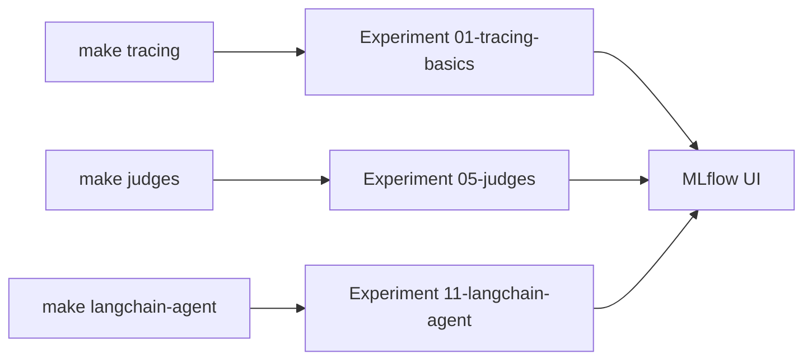

# Como usar

Guia prático para configurar o ambiente, rodar as demos e visualizar os resultados no
MLflow UI. Para entender os conceitos de observabilidade por trás das demos, veja o
[Workshop de Observabilidade em IA](./workshop-observabilidade-ia.md).

---

## 1. Pré-requisitos

| Requisito | Versão / Observação |
|-----------|---------------------|
| Python | >= 3.11 (o projeto usa 3.14) |
| [uv](https://docs.astral.sh/uv/) | package manager (substitui pip/poetry) |
| MLflow server | rodando, com **AI Gateway** configurado (endpoint OpenAI-compatible) |
| Backend SQL | PostgreSQL/MySQL/SQLite no tracking server — **só** para o módulo `datasets` |

> ℹ️ Os modelos **não** são chamados diretamente na OpenAI: todas as chamadas passam pelo
> **MLflow AI Gateway**, que expõe uma API compatível com OpenAI. A autenticação é
> gerenciada pelo Gateway (o `api_key` no cliente é apenas um placeholder).

---

## 2. Instalação

```bash
# Clonar o repositório e entrar na pasta
git clone <repo-url>
cd ia-observability

# Instalar todas as dependências
uv sync          # ou: make install
```

O `uv sync` cria o ambiente virtual `.venv/` e instala as dependências exatas do
`uv.lock`.

---

## 3. Configuração do `.env`

Copie o arquivo de exemplo e preencha com os dados do seu servidor MLflow:

```bash
cp .env.example .env
```

| Variável | Para que serve |
|----------|----------------|
| `mlflow_url` | Tracking server do MLflow (use backend **SQL** para o módulo `datasets`) |
| `mlflow_openia_url` | Base URL do AI Gateway (OpenAI-compatible) |
| `mlflow_model` | Modelo usado para inferência |
| `mlflow_judge_model` | Modelo usado por judges/scorers e pela reflexão do GEPA (pode ser diferente do de inferência) |

Exemplo:

```bash
mlflow_url=http://localhost:5000/
mlflow_openia_url=http://localhost:5000/gateway/mlflow/v1
mlflow_model=qwen3.5-9b
mlflow_judge_model=qwen3.5-9b
```

> O `config.py` carrega o `.env` automaticamente a partir da raiz do projeto. Não é
> preciso exportar variáveis manualmente.

---

## 4. Rodar as demos

Cada módulo é **autocontido** e cria seu próprio *experiment* numerado no MLflow.
Use o `Makefile` (recomendado) ou `uv run` diretamente.

### Via Makefile

```bash
make help        # lista todos os comandos disponíveis
make tracing     # 01 - tracing básico (auto-tracing, decorators, spans)
make tokens      # 02 - token usage e custo por chamada
make sessions    # 03 - sessions multi-turn e user tracking
make evaluation  # 04 - evaluation com scorers built-in
make judges      # 05 - LLM judges customizados + code-based scorers
make versioning  # 06 - version tracking com LoggedModel
make monitoring  # 07 - produção (async, sampling, feedback)
make benchmark   # 08 - benchmark comparativo de configurações
make toolcalls   # 09 - tool calling com observabilidade
make prompts     # 10 - prompt registry e versionamento
make langchain-agent  # 11 - LangChain agent (tools + sessions)
make datasets    # 12 - evaluation datasets (subir + buscar — requer SQL)
make prompt-opt  # 13 - prompt optimization (GEPA + Metaprompt)
make all         # executa todos os módulos em sequência
```

### Via `uv run`

```bash
uv run tracing
# ou pelo módulo:
uv run python -m ia_observability.tracing_basics
```

### Por onde começar

| Ordem | Demo | O que você aprende |
|-------|------|--------------------|
| 1º | `make tracing` | Como instrumentar chamadas ao modelo com 1 linha |
| 2º | `make tokens` | Como medir tokens e atribuir custo |
| 3º | `make judges` | Como avaliar a qualidade das respostas |
| 4º | `make langchain-agent` | Tracing automático de um agente com tools + sessions |
| 5º | `make monitoring` | Sampling e feedback para produção |

---

## 5. Visualizar no MLflow UI

Abra o endereço configurado em `mlflow_url`:

```
http://<mlflow_url>
```

Cada demo cria um experiment numerado (ex.: `01-tracing-basics`, `05-judges`). Lá você
encontra:

- **Traces** — árvore de spans com inputs, outputs, latência por etapa.
- **Token Usage / Cost Breakdown** — consumo e custo por trace/span.
- **Evaluation runs** — score + rationale de cada judge por exemplo.
- **Filtros** — traces filtráveis por `user` e `session_id`.



---

## 6. Gotchas (erros comuns)

Pontos que costumam pegar quem está começando — todos já tratados no código do projeto:

1. **Custo não aparece para modelos self-hosted.** O MLflow só calcula custo
   automaticamente para modelos com pricing registrado (OpenAI, Anthropic). Para modelos
   self-hosted, é preciso setar `span.set_attribute("mlflow.llm.cost", {...})` manualmente
   (ver `token_usage.py`).

2. **Trace vem `None` ao buscar logo após gerar.** O logging é assíncrono — chame
   `mlflow.flush_trace_async_logging()` antes de `get_trace()` / `search_traces()`.

3. **Judges built-in usam `openai:/gpt-4.1-mini` por padrão.** Passe
   `model="gateway:/<modelo>"` (constante `JUDGE_MODEL` em `config.py`) para rotear os
   judges pelo AI Gateway.

4. **Timeout de 60s nos judges.** Modelos lentos podem estourar; use
   `patch_judge_timeout(300)` de `config.py`.

5. **Code-based scorers (`@scorer`) devem retornar `Feedback`, `bool`, `float`, `str` ou
   `list[Feedback]`** — nunca `dict`.

6. **Módulo `datasets` exige backend SQL** no tracking server (não funciona com backend
   de arquivos).

7. **`SpanType.TOOL`** faz o span aparecer na aba "Tool calls" do MLflow UI.

---

## 7. Estrutura do projeto

```
src/ia_observability/
├── config.py                          # Configuração centralizada
├── parte1_fundamentos/                # 🟢 Fundamentos
│   ├── tracing_basics.py              # 01 - Auto-tracing, spans
│   └── token_usage.py                 # 02 - Tokens e custo
├── parte2_avaliacao/                  # 🟡 Avaliação
│   ├── evaluation.py                  # 04 - Scorers built-in
│   ├── judges.py                      # 05 - LLM judges customizados
│   └── datasets_demo.py               # 12 - Evaluation datasets
├── parte3_producao/                   # 🟡🔴 Produção
│   ├── sessions.py                    # 03 - Sessões multi-turn
│   ├── version_tracking.py            # 06 - Versionamento
│   ├── production_monitoring.py       # 07 - Sampling, feedback
│   ├── tool_calls.py                  # 09 - Tool calling manual
│   └── langchain_agent.py             # 11 - Agente LangChain
└── parte4_avancado/                   # 🔴 Avançado
    ├── experiment_comparison.py       # 08 - Benchmark de configs
    ├── prompt_management.py           # 10 - Prompt registry
    └── prompt_optimization.py         # 13 - GEPA + Metaprompting
```

---

## Próximos passos

- Leia o [Workshop de Observabilidade em IA](./workshop-observabilidade-ia.md) para os
  conceitos por trás de cada demo.
- Consulte a [documentação do MLflow GenAI](https://mlflow.org/docs/latest/genai/).
