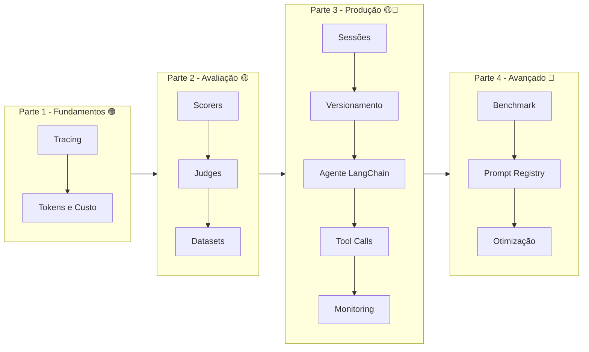

# 📚 Roteiro de Estudos — Observabilidade em IA com MLflow

> Guia de navegação para estudar o projeto `ia-observability` do zero.
> Siga a ordem sugerida. Cada parte termina com exercícios — faça-os
> antes de prosseguir.

---

## Como usar este guia

1. **Setup inicial**: configure o `.env` e rode `uv sync` (veja [Como usar](como-usar.md))
2. **Parte 1 → 2 → 3 → 4**: siga a ordem para construir conhecimento progressivamente
3. **Exercícios**: ao final de cada parte, resolva os exercícios ANTES de seguir
4. **MLflow UI**: depois de cada módulo, abra o experimento no MLflow UI para VER os traces

---

## Parte 1: Fundamentos 🟢

**Objetivo:** Entender tracing e custo — a base da observabilidade.

| Ordem | Módulo | Comando | Tempo | O que você vai aprender |
|-------|--------|---------|-------|------------------------|
| 1 | 01 - Tracing Básico | `uv run tracing` | 15min | Auto-tracing, spans, árvore de execução |
| 2 | 02 - Token Usage e Custo | `uv run tokens` | 15min | Tokens, custo, attribution manual |

**Conceitos-chave da parte:**
- Trace = requisição completa; Span = passo individual
- Auto-tracing: 1 linha instrumenta tudo
- Modelos self-hosted precisam de custo manual

**Exercícios:** `exercicios/parte1-fundamentos/`
- `ex01_trace_simples.md` — Adicione tracing a um pipeline existente
- `ex02_custo_customizado.md` — Calcule custo com outro pricing

**Checkpoint:** Ao final, você sabe responder "o que aconteceu na requisição?" e "quanto custou?".

---

## Parte 2: Avaliação 🟡

**Objetivo:** Medir a QUALIDADE das respostas do LLM.

| Ordem | Módulo | Comando | Tempo | O que você vai aprender |
|-------|--------|---------|-------|------------------------|
| 3 | 04 - Evaluation (Scorers Built-in) | `uv run evaluation` | 20min | Correctness, RelevanceToQuery, Guidelines |
| 4 | 05 - LLM Judges Customizados | `uv run judges` | 20min | Guidelines + @scorer + Feedback |
| 5 | 12 - Evaluation Datasets | `uv run datasets` | 15min | Subir e buscar datasets (requer SQL) |

**Conceitos-chave da parte:**
- LLM judges: qualidade subjetiva (custa tokens)
- Code-based scorers: regras objetivas (instantâneo)
- Dataset = perguntas + respostas esperadas

**Exercícios:** `exercicios/parte2-avaliacao/`
- `ex03_scorer_presenca_codigo.md` — Crie scorer que detecta código Python
- `ex04_dataset_customizado.md` — Crie dataset para seu domínio

**Checkpoint:** Você sabe medir se uma resposta está certa, relevante e segura.

---

## Parte 3: Produção 🟡🔴

**Objetivo:** Operar observabilidade em cenário real (multi-turno, tools, versionamento).

| Ordem | Módulo | Comando | Tempo | O que você vai aprender |
|-------|--------|---------|-------|------------------------|
| 6 | 03 - Sessions e User Tracking | `uv run sessions` | 15min | Vincular traces a usuário/sessão |
| 7 | 06 - Version Tracking | `uv run versioning` | 15min | LoggedModel, metadados por versão |
| 8 | 11 - Agente LangChain | `uv run langchain-agent` | 20min | Tracing automático de agentes |
| 9 | 09 - Tool Calling Manual | `uv run toolcalls` | 20min | SpanType.TOOL, latência por ferramenta |
| 10 | 07 - Monitoramento em Produção | `uv run monitoring` | 20min | Sampling, feedback, async |

**Conceitos-chave da parte:**
- Sessions agrupam traces de uma conversa
- SpanType.TOOL mostra ferramentas na aba "Tool Calls"
- LangChain autolog captura tudo automaticamente
- Sampling reduz custo em produção
- Feedback humano fecha o ciclo

**Exercícios:** `exercicios/parte3-producao/`
- `ex05_session_com_agente.md` — Adicione session tracking ao langchain_agent
- `ex06_sampling_customizado.md` — Crie 3 níveis de sampling

**Checkpoint:** Você sabe operar observabilidade em produção com agentes e ferramentas.

---

## Parte 4: Avançado 🔴

**Objetivo:** Otimizar prompts e comparar configurações sistematicamente.

| Ordem | Módulo | Comando | Tempo | O que você vai aprender |
|-------|--------|---------|-------|------------------------|
| 11 | 08 - Benchmark | `uv run benchmark` | 20min | Comparar configs lado a lado |
| 12 | 10 - Prompt Registry | `uv run prompts` | 20min | Versionar prompts, vincular a traces |
| 13 | 13 - Prompt Optimization | `uv run prompt-opt` | 30min | GEPA, Metaprompting |

**Conceitos-chave da parte:**
- Benchmark = mesma avaliação em múltiplas configs
- Prompt Registry = git para prompts
- GEPA = otimização baseada em dados de avaliação
- Metaprompting = reestruturação zero-shot

**Exercícios:** `exercicios/parte4-avancado/`
- `ex07_benchmark_modelos.md` — Compare 2 modelos diferentes
- `ex08_gepa_dataset.md` — Crie dataset próprio para o GEPA

**Checkpoint:** Você fecha o ciclo: observar → medir → otimizar.

---

## Mapa da Progressão

---

## Atalhos por Perfil

**Sou novo em LLMs:** Comece pela Parte 1 e vá em ordem.
**Já uso tracing:** Pule para Parte 2 (Avaliação).
**Quero por em produção:** Vá direto para Parte 3.
**Preciso otimizar:** Parte 4 é pra você.

---

## Referências

- [MLflow GenAI Docs](https://mlflow.org/docs/latest/genai/)
- [Workshop de Observabilidade](workshop-observabilidade-ia.md)
- [Como usar o projeto](como-usar.md)
