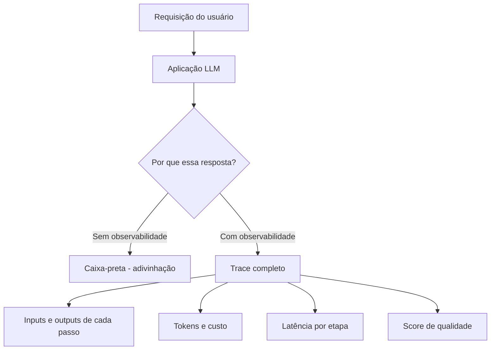
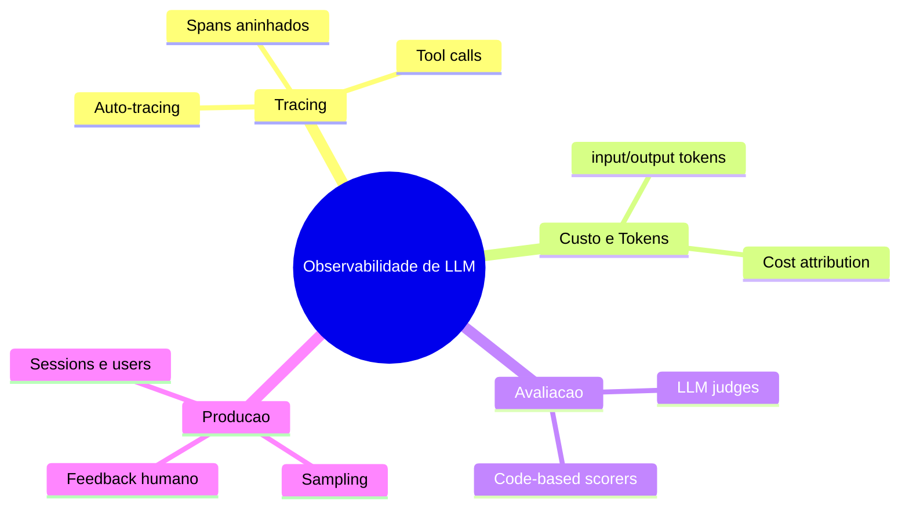
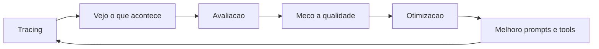

# Observabilidade em IA

### Workshop prático — 1 hora · MLflow GenAI

> Material de apresentação baseado no projeto `ia-observability`. Todos os trechos de
> código são reais e podem ser rodados ao vivo via `make <target>` ou `uv run <demo>`.

> **Nota sobre organização:** Os módulos estão organizados em 4 partes didáticas
> na estrutura de pastas. Consulte o [Roteiro de Estudos](learning-path.md) para
> a ordem recomendada de execução.

---

## Roteiro de 1 hora

| Tempo | Bloco | Conteúdo |
|-------|-------|----------|
| 0–10 min | **1. Por que observabilidade em IA?** | A "caixa-preta" dos LLMs e o que muda em produção |
| 10–20 min | **2. Caso de uso e problema** | O incidente que ninguém consegue debugar |
| 20–25 min | **3. Os 4 pilares** | Tracing, Custo, Avaliação, Monitoramento |
| 25–50 min | **4. Como usar (demos ao vivo)** | Código + MLflow UI |
| 50–60 min | **5. Fechamento + Q&A** | Checklist e próximos passos |

> **Setup antes de começar:** tenha o MLflow UI aberto em uma aba e o terminal em outra.
> Cada demo cria um *experiment* numerado (ex.: `01-tracing-basics`).

---

## 1. Por que observabilidade em IA é importante?

### A diferença entre software tradicional e IA

No software tradicional, o mesmo input gera **sempre** o mesmo output. Você consegue
reproduzir um bug, escrever um teste determinístico e ter certeza de que está corrigido.

Com LLMs isso quebra:

- **Não-determinismo:** o mesmo prompt pode gerar respostas diferentes a cada chamada.
- **Caixa-preta:** você não vê *por que* o modelo respondeu daquela forma.
- **Falha silenciosa:** o modelo quase nunca dá "erro 500" — ele **alucina** com
  confiança total e devolve HTTP 200.
- **Custo variável:** cada chamada tem um custo em tokens que se multiplica em escala.
- **Pipelines complexos:** um agente moderno faz RAG + várias tool calls + múltiplas
  idas ao LLM. Quando o resultado final está errado, **qual etapa falhou?**

### O que é observabilidade em IA?

> É a capacidade de entender o estado interno de uma aplicação de IA a partir das suas
> saídas externas: *traces* de execução, *tokens/custo*, *latência* e *qualidade* das
> respostas.



**A mensagem-chave do bloco:** sem observabilidade, melhorar uma aplicação de IA vira
chute. Com ela, vira engenharia.

---

## 2. Caso de uso e o problema que ela resolve

### Cenário: assistente de suporte com agente + tools

Imagine um assistente que responde clientes e usa **ferramentas** (consultar tempo,
buscar na documentação, calcular, verificar estoque). Em produção:

> *"Um cliente reclamou que o bot deu uma resposta errada às 14h32. O time não consegue
> reproduzir. A conta de inferência triplicou no mês. Ninguém sabe qual ferramenta está
> lenta nem qual versão do prompt está no ar."*

Esse é o problema. Sem observabilidade, cada uma dessas perguntas é impossível de
responder:

| Pergunta do time | O que resolve |
|------------------|---------------|
| "O que exatamente o usuário enviou e o que o modelo respondeu?" | **Tracing** |
| "Qual ferramenta o agente chamou? Ela falhou ou demorou?" | **Spans de tool** |
| "Por que a conta de tokens explodiu?" | **Token usage + custo** |
| "Essa resposta estava certa? Quantas estão erradas?" | **Avaliação / Judges** |
| "Qual versão do prompt gerou isso?" | **Prompt registry / versionamento** |
| "Quero auditar 100% de pagamentos, mas só 10% do resto" | **Sampling em produção** |

### Como uma tool lenta aparece num trace

O projeto simula exatamente esse incidente — uma ferramenta que dá timeout
(`langchain_agent.py`):

```python
@tool
def check_inventory(product: str) -> str:
    """Consulta o estoque disponivel de um produto."""
    # Simula latencia alta seguida de falha
    time.sleep(2.5)
    return f"ERRO: Timeout ao consultar estoque do produto '{product}' - API indisponivel"
```

No MLflow UI, esse `time.sleep(2.5)` aparece como um span de 2,5s dentro do trace — o
gargalo fica **visível e mensurável**, em vez de ser um mistério.

---

## 3. Os 4 pilares da observabilidade de LLM



1. **Tracing** — registra cada passo da execução (inputs, outputs, latência).
2. **Custo & Tokens** — quanto cada chamada consome e quanto custa.
3. **Avaliação** — mede a *qualidade* das respostas de forma sistemática.
4. **Produção** — opera tudo isso em escala (sampling, feedback, sessions).

---

## 4. Como usar (demos ao vivo)

> A stack: **MLflow GenAI** para observabilidade + **OpenAI SDK** apontando para o
> **MLflow AI Gateway** (endpoint compatível com OpenAI). Cada demo é autocontida.

### Demo 1 — Tracing em 1 linha (auto-tracing)

`make tracing` · módulo `tracing_basics.py`

O ponto mais importante para começar: **uma única linha** instrumenta todas as chamadas
ao modelo.

```python
import mlflow
from ia_observability.config import MODEL_NAME, get_client

def demo_auto_tracing() -> None:
    mlflow.openai.autolog()   # <- captura inputs, outputs, tokens e latência
    client = get_client()

    response = client.chat.completions.create(
        model=MODEL_NAME,
        messages=[
            {"role": "system", "content": "Voce e um assistente util."},
            {"role": "user", "content": "O que e observabilidade em sistemas de IA?"},
        ],
    )
    print(response.choices[0].message.content)
```

**O que mostrar no UI:** abra o trace gerado e mostre que inputs, output, contagem de
tokens e latência já estão lá — sem nenhuma instrumentação manual.

### Demo 2 — Pipelines complexos: spans aninhados (padrão RAG)

Quando há várias etapas, o decorator `@mlflow.trace` cria uma **árvore de execução**.
Cada função vira um span filho:

```python
@mlflow.trace
def demo_rag_pipeline(question: str) -> str:
    context = retrieve_context(question)        # vira um span filho
    answer = generate_answer(question, context) # vira outro span filho
    return answer

@mlflow.trace(span_type="RETRIEVER")
def retrieve_context(question: str) -> str:
    ...  # em produção: busca em vector store (Pinecone, Chroma...)

@mlflow.trace(span_type="LLM")
def generate_answer(question: str, context: str) -> str:
    ...  # chamada ao modelo com o contexto recuperado
```

**Por que importa:** quando a resposta final está errada, você vê se o problema foi o
*retrieval* (contexto ruim) ou a *geração* (modelo). É aqui que o trace responde
"qual etapa falhou?".

### Demo 3 — Quanto isso custa? (tokens + cost)

`make tokens` · módulo `token_usage.py`

> ⚠️ **Gotcha importante:** o MLflow calcula custo automaticamente apenas para modelos
> com pricing registrado (OpenAI, Anthropic). Para modelos **self-hosted**, você seta o
> custo manualmente no span.

```python
def _set_usage_and_cost(span, usage) -> None:
    input_tokens = usage.prompt_tokens or 0
    output_tokens = usage.completion_tokens or 0

    input_cost = input_tokens * CUSTOM_INPUT_COST_PER_TOKEN
    output_cost = output_tokens * CUSTOM_OUTPUT_COST_PER_TOKEN

    span.set_attribute("mlflow.chat.tokenUsage", {
        "input_tokens": input_tokens,
        "output_tokens": output_tokens,
        "total_tokens": usage.total_tokens,
    })
    span.set_attribute("mlflow.llm.cost", {
        "input_cost": input_cost,
        "output_cost": output_cost,
        "total_cost": input_cost + output_cost,
    })
```

**O que mostrar no UI:** o "Cost Breakdown" e o gráfico de Token Usage por trace. É assim
que você responde "por que a conta triplicou?".

### Demo 4 — A resposta estava certa? (avaliação com judges)

`make judges` · módulo `judges.py`

Existem dois tipos de "avaliador":

**a) LLM judge** — usa um modelo para julgar a resposta segundo regras em linguagem
natural:

```python
from mlflow.genai.scorers import Guidelines

Guidelines(
    name="technical_accuracy",
    guidelines=(
        "A resposta deve ser tecnicamente precisa sobre MLflow e MLOps. "
        "Nao deve conter informacoes inventadas ou desatualizadas."
    ),
    model=JUDGE_MODEL,
)
```

**b) Code-based scorer** — regra determinística em Python, sem custo de LLM:

```python
from mlflow.genai.scorers import scorer
from mlflow.entities.assessment import Feedback

@scorer
def no_hallucination_keywords(inputs, outputs) -> Feedback:
    """Detecta marcadores de alucinacao na resposta."""
    red_flags = [
        "estudos mostram que 99%",
        "foi comprovado cientificamente",
        "todos os especialistas concordam",
    ]
    found = [f for f in red_flags if f in str(outputs).lower()]
    if found:
        return Feedback(value=False, rationale=f"Indicadores de alucinacao: {found}")
    return Feedback(value=True, rationale="Nenhum indicador detectado.")
```

E roda-se uma avaliação em lote sobre um dataset:

```python
results = mlflow.genai.evaluate(
    data=dataset,
    predict_fn=predict_fn,
    scorers=[
        Guidelines(name="technical_accuracy", guidelines=..., model=JUDGE_MODEL),
        no_hallucination_keywords,       # code-based: instantâneo, sem custo
        response_length_check,
        contains_actionable_info,
    ],
)
```

> 💡 **Dica:** combine os dois. Judges LLM medem qualidade subjetiva; scorers de código
> garantem regras objetivas de graça e sem latência.

### Demo 5 — Agente real com tools + sessions (tracing automático)

`make langchain-agent` · módulo `langchain_agent.py`

Em um agente LangChain, o tracing é 100% automático. Uma linha liga tudo:

```python
mlflow.langchain.autolog()   # captura AGENT, CHAT_MODEL e TOOL spans automaticamente
agent = build_agent()
```

E para rastrear **quem** falou e em **qual sessão** (essencial para suporte multi-turn):

```python
def agent_invoke(agent, query: str, user_id: str, session_id: str) -> str:
    config = {"configurable": {"thread_id": session_id}}  # mantém histórico
    result = agent.invoke({"messages": [HumanMessage(content=query)]}, config=config)

    # vincula user e session ao trace -> filtrável no UI
    mlflow.update_current_trace(session_id=session_id, user=user_id)

    return result["messages"][-1].content
```

O **ciclo de execução** do agente (ReAct — Reason + Act) funciona assim:

| Componente | O que o autolog captura |
|-----------|------------------------|
| Tool call (`get_weather`, `search_docs`) | Span `TOOL` com input/output e latência |
| Chamada ao LLM | Span `CHAT_MODEL` com tokens e custo |
| Loop de raciocínio | Span `AGENT` com plano de ação |
| Sessão multi-turn | Histórico mantido via `MemorySaver` (checkpointer) |
| Falha de tool (timeout) | Span `TOOL` com erro e duração visíveis |

**O que mostrar no UI:** o trace com a árvore `AGENT > CHAT_MODEL > TOOL > CHAT_MODEL`, e
o filtro de traces por `user` e `session_id`.

### Demo 6 — Feedback humano + sampling em produção

`make monitoring` · módulo `production_monitoring.py`

Em produção você não quer (nem precisa) tracear 100% de tudo — storage e custo importam.
O **sampling diferenciado por criticidade** resolve isso com `sampling_ratio_override`:

```python
@mlflow.trace(sampling_ratio_override=1.0)   # 100% — auditoria total (ex.: pagamentos)
def critical_agent_call(agent, query, user_id, session_id) -> str:
    return agent_invoke(agent, query, user_id, session_id)

@mlflow.trace(sampling_ratio_override=0.1)   # 10% — alto volume, baixa criticidade
def high_volume_agent_call(agent, query, user_id, session_id) -> str:
    return agent_invoke(agent, query, user_id, session_id)
```

E **feedback humano** anexado ao trace (👍/👎 do usuário, revisão do time):

```python
trace_id = mlflow.get_last_active_trace_id()
mlflow.log_feedback(
    trace_id=trace_id,
    name="user_rating",
    value=True,
    source=AssessmentSource(source_type="HUMAN", source_id="reviewer-marcos"),
)
```

E quando o usuário quer **enviar uma mensagem** (comentário em texto), use o campo
`rationale` para anexar o texto livre ao mesmo trace:

```python
mlflow.log_feedback(
    trace_id=trace_id,
    name="user_comment",
    value=False,                                  # 👎 acompanhado de um comentário
    rationale="A resposta ignorou minha pergunta sobre preço.",  # mensagem do usuário
    source=AssessmentSource(source_type="HUMAN", source_id="cliente-123"),
)
```

> 💡 O `rationale` é texto livre — é onde entra a mensagem escrita pelo usuário (ou a
> justificativa do reviewer). Combine `value` (👍/👎 ou nota) com `rationale` (o porquê)
> para entender **o que** falhou e **por quê**.

> ⚠️ **Gotcha:** sempre chame `mlflow.flush_trace_async_logging()` antes de
> `get_trace()` / `search_traces()` — senão o resultado vem `None` (logging é assíncrono).

---

## 5. Fechamento

### O ciclo virtuoso da observabilidade



Observabilidade não é só "ver logs" — é o que **fecha o ciclo** entre observar, medir e
melhorar uma aplicação de IA.

### Checklist para levar para casa

- [ ] Ligue auto-tracing (`mlflow.openai.autolog()` / `mlflow.langchain.autolog()`)
- [ ] Use spans aninhados em pipelines (RAG, agentes) para isolar a etapa que falha
- [ ] Atribua custo manualmente se o modelo for self-hosted
- [ ] Combine LLM judges (qualidade) + code-based scorers (regras objetivas)
- [ ] Vincule `user_id` e `session_id` aos traces
- [ ] Em produção: sampling por criticidade + coleta de feedback humano
- [ ] Lembre do `flush_trace_async_logging()` antes de ler traces

### Comandos para explorar depois do workshop

```bash
uv sync                 # instala dependências
make tracing            # 01 - tracing básico
make tokens             # 02 - tokens e custo
make judges             # 05 - avaliação com judges
make langchain-agent    # 11 - agente com tools + sessions
make monitoring         # 07 - sampling e feedback em produção
make help               # lista todas as demos
```

### Referências

- [MLflow GenAI Docs](https://mlflow.org/docs/latest/genai/)
- [Tracing Quickstart](https://mlflow.org/docs/latest/genai/tracing/quickstart/)
- [Evaluation & Monitoring](https://mlflow.org/docs/latest/genai/eval-monitor/)
- [LLM Judges / Scorers](https://mlflow.org/docs/latest/genai/eval-monitor/scorers/)
- [Production Monitoring](https://mlflow.org/docs/latest/genai/tracing/prod-tracing/)
