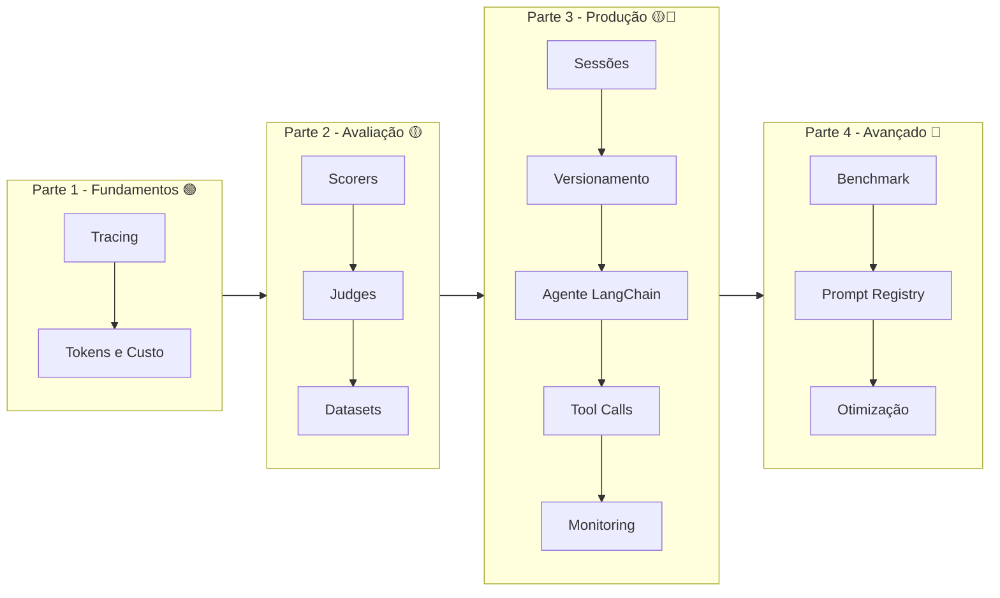
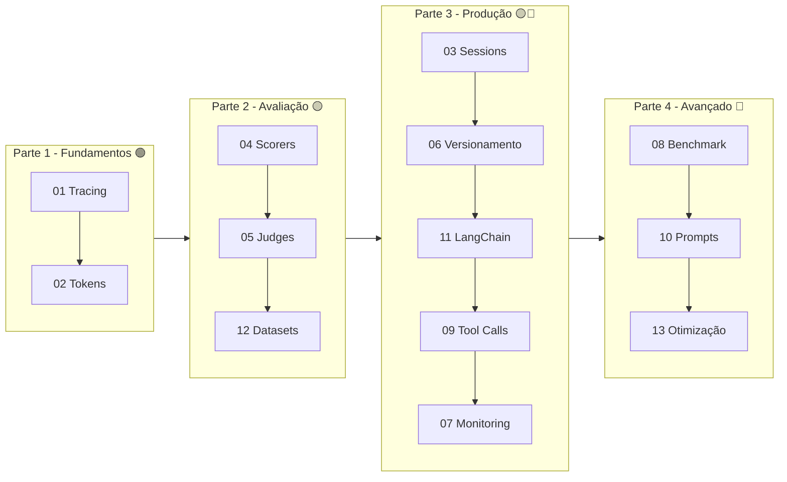

# [Melhoria Didática] Plano de Implementação

> **For agentic workers:** REQUIRED SUB-SKILL: Use compose:subagent (recommended) or compose:execute to implement this plan task-by-task. Steps use checkbox (`- [ ]`) syntax for tracking.

**Goal:** Transform `ia-observability` de um projeto de referência em um material didático estruturado para workshops/treinamento, com organização em partes, cabeçalhos educativos, exercícios e roteiro de estudos.

**Architecture:** Reorganizar os 13 módulos em 4 partes temáticas (fundamentos, avaliação, produção, avançado), adicionar template educativo consistente em cada módulo (objetivos + resumo), criar learning path e exercícios, atualizar README com badges e mapa visual. Código funcional existente não é alterado — apenas movido e acrescido de conteúdo textual.

**Tech Stack:** Python 3.14 / MLflow GenAI / uv / hatchling (mesmo stack do projeto)

## Global Constraints

1. **Entrypoints do pyproject.toml devem continuar funcionando** — `uv run tracing`, `uv run tokens`, etc. Não quebrar a interface CLI existente.
2. **Makefile permanece idêntico** — nenhuma alteração nos targets.
3. **Código funcional existente não é alterado** — apenas movido de pasta e acrescido de docstrings/prints educativos. Nenhuma lógica de tracing, evaluation, etc. é modificada.
4. **Português brasileiro** para todo o conteúdo didático (docstrings, prints, docs, exercícios).
5. **Nomes de experimentos MLflow** mantidos (ex: `01-tracing-basics`, `04-evaluation`) — a numeração original permanece como identificador do experimento.
6. **Números de módulo originais preservados** nos nomes de arquivo e experimentos, mesmo dentro das novas pastas.

---

## File Structure (Pre-Plano)

Antes da reorganização:
```
src/ia_observability/
├── config.py
├── tracing_basics.py
├── token_usage.py
├── sessions.py
├── evaluation.py
├── judges.py
├── version_tracking.py
├── production_monitoring.py
├── experiment_comparison.py
├── tool_calls.py
├── prompt_management.py
├── langchain_agent.py
├── datasets_demo.py
└── prompt_optimization.py
```

Depois da reorganização:
```
src/ia_observability/
├── __init__.py
├── config.py                          # inalterado
├── parte1_fundamentos/
│   ├── __init__.py
│   ├── tracing_basics.py              # movido + cabeçalho educativo
│   └── token_usage.py                 # movido + cabeçalho educativo
├── parte2_avaliacao/
│   ├── __init__.py
│   ├── evaluation.py                  # movido + cabeçalho educativo
│   ├── judges.py                      # movido + cabeçalho educativo
│   └── datasets_demo.py               # movido + cabeçalho educativo
├── parte3_producao/
│   ├── __init__.py
│   ├── sessions.py                    # movido + cabeçalho educativo
│   ├── version_tracking.py            # movido + cabeçalho educativo
│   ├── production_monitoring.py       # movido + cabeçalho educativo
│   ├── tool_calls.py                  # movido + cabeçalho educativo
│   └── langchain_agent.py             # movido + cabeçalho educativo
├── parte4_avancado/
│   ├── __init__.py
│   ├── experiment_comparison.py       # movido + cabeçalho educativo
│   ├── prompt_management.py           # movido + cabeçalho educativo
│   └── prompt_optimization.py         # movido + cabeçalho educativo
```

No pyproject.toml, os entrypoints são atualizados para apontar para os novos paths (ex: `tracing = "ia_observability.parte1_fundamentos.tracing_basics:main"`).

---

## Tasks

### Task 1: Reorganizar arquivos em partes com __init__.py e atualizar entrypoints

**Covers:** [S1]

**Files:**
- Create: `src/ia_observability/parte1_fundamentos/__init__.py`
- Create: `src/ia_observability/parte2_avaliacao/__init__.py`
- Create: `src/ia_observability/parte3_producao/__init__.py`
- Create: `src/ia_observability/parte4_avancado/__init__.py`
- Create: `src/ia_observability/parte1_fundamentos/tracing_basics.py`
- Create: `src/ia_observability/parte1_fundamentos/token_usage.py`
- Create: `src/ia_observability/parte2_avaliacao/evaluation.py`
- Create: `src/ia_observability/parte2_avaliacao/judges.py`
- Create: `src/ia_observability/parte2_avaliacao/datasets_demo.py`
- Create: `src/ia_observability/parte3_producao/sessions.py`
- Create: `src/ia_observability/parte3_producao/version_tracking.py`
- Create: `src/ia_observability/parte3_producao/production_monitoring.py`
- Create: `src/ia_observability/parte3_producao/tool_calls.py`
- Create: `src/ia_observability/parte3_producao/langchain_agent.py`
- Create: `src/ia_observability/parte4_avancado/experiment_comparison.py`
- Create: `src/ia_observability/parte4_avancado/prompt_management.py`
- Create: `src/ia_observability/parte4_avancado/prompt_optimization.py`
- Modify: `pyproject.toml` (entrypoints)

**Interfaces:**
- Consumes: existing `.py` files at `src/ia_observability/*.py` (config.py e os 13 módulos)
- Produces: new directory structure with identical file content (initial copy, no educational content yet)

- [ ] **Step 1: Criar diretórios das partes**

```bash
mkdir -p src/ia_observability/parte1_fundamentos \
         src/ia_observability/parte2_avaliacao \
         src/ia_observability/parte3_producao \
         src/ia_observability/parte4_avancado
```

- [ ] **Step 2: Criar __init__.py vazios em cada parte**

```bash
touch src/ia_observability/parte1_fundamentos/__init__.py \
      src/ia_observability/parte2_avaliacao/__init__.py \
      src/ia_observability/parte3_producao/__init__.py \
      src/ia_observability/parte4_avancado/__init__.py
```

- [ ] **Step 3: Copiar cada módulo para sua respectiva parte**

> Use `cp` para preservar o conteúdo original. Nesta task, apenas copiamos — o conteúdo educativo será adicionado nas tasks subsequentes.

```bash
# Parte 1 - Fundamentos
cp src/ia_observability/tracing_basics.py src/ia_observability/parte1_fundamentos/
cp src/ia_observability/token_usage.py src/ia_observability/parte1_fundamentos/

# Parte 2 - Avaliação
cp src/ia_observability/evaluation.py src/ia_observability/parte2_avaliacao/
cp src/ia_observability/judges.py src/ia_observability/parte2_avaliacao/
cp src/ia_observability/datasets_demo.py src/ia_observability/parte2_avaliacao/

# Parte 3 - Produção
cp src/ia_observability/sessions.py src/ia_observability/parte3_producao/
cp src/ia_observability/version_tracking.py src/ia_observability/parte3_producao/
cp src/ia_observability/production_monitoring.py src/ia_observability/parte3_producao/
cp src/ia_observability/tool_calls.py src/ia_observability/parte3_producao/
cp src/ia_observability/langchain_agent.py src/ia_observability/parte3_producao/

# Parte 4 - Avançado
cp src/ia_observability/experiment_comparison.py src/ia_observability/parte4_avancado/
cp src/ia_observability/prompt_management.py src/ia_observability/parte4_avancado/
cp src/ia_observability/prompt_optimization.py src/ia_observability/parte4_avancado/
```

- [ ] **Step 4: Atualizar entrypoints no pyproject.toml**

Substituir os paths em `[project.scripts]`:

```python
# Antes (pyproject.toml):
tracing = "ia_observability.tracing_basics:main"
tokens = "ia_observability.token_usage:main"
sessions = "ia_observability.sessions:main"
evaluation = "ia_observability.evaluation:main"
judges = "ia_observability.judges:main"
versioning = "ia_observability.version_tracking:main"
monitoring = "ia_observability.production_monitoring:main"
benchmark = "ia_observability.experiment_comparison:main"
toolcalls = "ia_observability.tool_calls:main"
prompts = "ia_observability.prompt_management:main"
langchain-agent = "ia_observabilidad.langchain_agent:main"
datasets = "ia_observability.datasets_demo:main"
prompt-opt = "ia_observability.prompt_optimization:main"
```

Substituir por:

```python
[project.scripts]
tracing = "ia_observability.parte1_fundamentos.tracing_basics:main"
tokens = "ia_observability.parte1_fundamentos.token_usage:main"
sessions = "ia_observability.parte3_producao.sessions:main"
evaluation = "ia_observability.parte2_avaliacao.evaluation:main"
judges = "ia_observability.parte2_avaliacao.judges:main"
versioning = "ia_observability.parte3_producao.version_tracking:main"
monitoring = "ia_observability.parte3_producao.production_monitoring:main"
benchmark = "ia_observability.parte4_avancado.experiment_comparison:main"
toolcalls = "ia_observability.parte3_producao.tool_calls:main"
prompts = "ia_observability.parte4_avancado.prompt_management:main"
langchain-agent = "ia_observability.parte3_producao.langchain_agent:main"
datasets = "ia_observability.parte2_avaliacao.datasets_demo:main"
prompt-opt = "ia_observability.parte4_avancado.prompt_optimization:main"
```

- [ ] **Step 5: Verificar que os entrypoints funcionam**

```bash
uv sync
uv run tracing --help 2>&1 || uv run tracing
```

O comando deve executar a demo normalmente (pode falhar se não houver MLflow server, mas o erro deve ser de conexão, não de import).

- [ ] **Step 6: Commit**

```bash
git add src/ia_observability/parte1_fundamentos/ \
        src/ia_observability/parte2_avaliacao/ \
        src/ia_observability/parte3_producao/ \
        src/ia_observability/parte4_avancado/ \
        pyproject.toml
git rm src/ia_observability/tracing_basics.py \
       src/ia_observability/token_usage.py \
       src/ia_observability/sessions.py \
       src/ia_observability/evaluation.py \
       src/ia_observability/judges.py \
       src/ia_observability/version_tracking.py \
       src/ia_observability/production_monitoring.py \
       src/ia_observability/experiment_comparison.py \
       src/ia_observability/tool_calls.py \
       src/ia_observability/prompt_management.py \
       src/ia_observability/langchain_agent.py \
       src/ia_observability/datasets_demo.py \
       src/ia_observability/prompt_optimization.py
git commit -m "feat: reorganizar modulos em 4 partes tematicas"
```

---

### Task 2: Adicionar cabeçalho e rodapé educativo — Parte 1 (Fundamentos)

**Covers:** [S2]

**Files:**
- Modify: `src/ia_observability/parte1_fundamentos/tracing_basics.py`
- Modify: `src/ia_observability/parte1_fundamentos/token_usage.py`

**Interfaces:**
- Consumes: arquivos copiados na Task 1
- Produces: mesmos arquivos com docstring educativa no topo e bloco de resumo no `main()`

- [ ] **Step 1: Adicionar cabeçalho educativo em tracing_basics.py**

Substituir o docstring inicial (linhas 1-9) por:

```python
"""
[Parte 1 — Fundamentos] Módulo 01: Tracing Básico
===================================================
╔══════════════════════════════════════════════════════════╗
║  OBJETIVOS DE APRENDIZADO                               ║
║  • Entender o que é tracing e por que isso importa      ║
║  • Conhecer as 3 formas de instrumentar código com      ║
║    MLflow: auto-tracing, decorator e context block      ║
║  • Visualizar spans e árvores de execução no MLflow UI  ║
║  • Conectar o conceito ao problema real de debug        ║
╚══════════════════════════════════════════════════════════╝

CONCEITO-CHAVE:
  Tracing é o equivalente a um "gravador de chamadas" para LLMs.
  Cada requisição vira um TRACE, que contém SPANS (passos individuais).
  Isso responde: "O que aconteceu exatamente nesta requisição?"

PRÉ-REQUISITOS:  Nenhum (ponto de partida do workshop)
DIFICULDADE:     🟢 Fácil
TEMPO ESTIMADO:  15 min para ler código + rodar + explorar UI

--- Como usar este módulo ---
  Apenas rode:  uv run tracing
  Ou:           make tracing

  O código executa 3 demos e imprime o resultado no terminal.
  Depois abra o MLflow UI no experiment '01-tracing-basics'
  para VER os traces gerados.

Referência: https://mlflow.org/docs/latest/genai/tracing/quickstart/
"""
```

- [ ] **Step 2: Adicionar rodapé educativo no main() de tracing_basics.py**

No final da função `main()`, ANTES do `if __name__ == "__main__":`, substituir os prints finais (linhas 172-175) por:

```python
    # ────────────────────────────────────────────────────
    #  ✅ RESUMO DO QUE APRENDEMOS NESTE MÓDULO
    # ────────────────────────────────────────────────────
    #  ✔ Auto-tracing (mlflow.openai.autolog): 1 linha
    #     instrumenta TODAS as chamadas ao modelo.
    #  ✔ Decorator @mlflow.trace: cria spans em
    #     funções customizadas sem esforço.
    #  ✔ Context block (mlflow.start_span): tracing
    #     sem precisar refatorar em funções.
    #  ✔ Spans aninhados: formam uma árvore de execução
    #     que mostra exatamente onde cada etapa ocorreu.
    #
    #  🔍 Agora abra o MLflow UI → Experiment:
    #     '01-tracing-basics' e explore a árvore de
    #     spans do pipeline RAG (Demo 2).
    #
    #  💡 EXERCÍCIO SUGERIDO (tente sem olhar o código):
    #     Adicione uma nova função "busca_web(pergunta)"
    #     decorada com @mlflow.trace(span_type="RETRIEVER")
    #     e veja o span extra aparecer na árvore.
    # ────────────────────────────────────────────────────
    print("\n" + "-" * 60)
    print("✅ MÓDULO CONCLUÍDO! Resumo do aprendizado acima.")
    print("  Experiment: 01-tracing-basics no MLflow UI")
    print("-" * 60)
```

- [ ] **Step 3: Adicionar cabeçalho educativo em token_usage.py**

Substituir o docstring inicial (linhas 1-13) por:

```python
"""
[Parte 1 — Fundamentos] Módulo 02: Token Usage e Custo
========================================================
╔══════════════════════════════════════════════════════════╗
║  OBJETIVOS DE APRENDIZADO                               ║
║  • Entender o que são tokens e por que custam dinheiro  ║
║  • Saber como o MLflow captura token usage              ║
║  • Aprender a atribuir custo manualmente para modelos   ║
║    self-hosted (que não têm pricing registrado)          ║
║  • Visualizar custo por span em pipelines multi-step    ║
╚══════════════════════════════════════════════════════════╝

CONCEITO-CHAVE:
  Toda chamada a um LLM consome INPUT tokens (o que você envia)
  e OUTPUT tokens (o que o modelo gera). Isso tem um CUSTO.
  Modelos comerciais (OpenAI, Anthropic) têm pricing conhecido;
  modelos self-hosted (via Gateway) precisam de atribuição manual.

PRÉ-REQUISITOS:  Módulo 01 (tracing_basics) — entender spans
DIFICULDADE:     🟢 Fácil
TEMPO ESTIMADO:  15 min

--- Como usar ---
  uv run tokens    ou    make tokens

Referência: https://mlflow.org/docs/latest/genai/tracing/token-usage-cost/
"""
```

- [ ] **Step 4: Adicionar rodapé educativo no main() de token_usage.py**

No final de `main()`, substituir os prints finais (linhas 258-261) por:

```python
    # ────────────────────────────────────────────────────
    #  ✅ RESUMO DO QUE APRENDEMOS NESTE MÓDULO
    # ────────────────────────────────────────────────────
    #  ✔ MLflow captura token usage automaticamente com
    #     mlflow.openai.autolog().
    #  ✔ Para modelos self-hosted, o custo precisa ser
    #     setado manualmente via span attributes.
    #  ✔ Padrão: calcular input_cost + output_cost usando
    #     pricing customizado e setar em
    #     span.set_attribute("mlflow.llm.cost", {...}).
    #  ✔ Custos por span individual permitem ver qual
    #     etapa do pipeline está mais cara.
    #
    #  🔍 MLflow UI → Experiment '02-token-usage':
    #     gráfico de Token Usage e Cost Breakdown.
    #
    #  💡 EXERCÍCIO: Mude CUSTOM_INPUT_COST_PER_TOKEN e
    #     CUSTOM_OUTPUT_COST_PER_TOKEN para refletir o
    #     custo real do seu modelo (GPU, energia) e rode
    #     novamente. O custo total mudou?
    # ────────────────────────────────────────────────────
    print("\n" + "-" * 60)
    print("✅ MÓDULO CONCLUÍDO! Resumo do aprendizado acima.")
    print("  Experiment: 02-token-usage no MLflow UI")
    print("-" * 60)
```

- [ ] **Step 5: Verificar sintaxe**

```bash
python -c "import ast; ast.parse(open('src/ia_observability/parte1_fundamentos/tracing_basics.py').read()); print('OK')"
python -c "import ast; ast.parse(open('src/ia_observability/parte1_fundamentos/token_usage.py').read()); print('OK')"
```

- [ ] **Step 6: Commit**

```bash
git add src/ia_observability/parte1_fundamentos/
git commit -m "feat: adicionar cabecalho e rodape educativo na Parte 1"
```

---

### Task 3: Adicionar cabeçalho e rodapé educativo — Parte 2 (Avaliação)

**Covers:** [S2]

**Files:**
- Modify: `src/ia_observability/parte2_avaliacao/evaluation.py`
- Modify: `src/ia_observability/parte2_avaliacao/judges.py`
- Modify: `src/ia_observability/parte2_avaliacao/datasets_demo.py`

- [ ] **Step 1: evaluation.py — cabeçalho educativo**

Substituir docstring inicial (linhas 1-16) por:

```python
"""
[Parte 2 — Avaliação] Módulo 04: Evaluation com Scorers Built-in
==================================================================
╔══════════════════════════════════════════════════════════╗
║  OBJETIVOS DE APRENDIZADO                               ║
║  • Entender o que é avaliação sistemática de LLMs       ║
║  • Conhecer os scorers built-in do MLflow (Correctness, ║
║    RelevanceToQuery, Guidelines, Safety, Fluency)        ║
║  • Criar um dataset de avaliação com inputs/expecations  ║
║  • Rodar mlflow.genai.evaluate() e interpretar métricas ║
╚══════════════════════════════════════════════════════════╝

CONCEITO-CHAVE:
  "Se não dá para medir, não dá para melhorar." Avaliação
  sistemática usa DATASETS de perguntas com respostas esperadas
  e SCORERS (judges) que medem a qualidade automaticamente.
  Isso substitui o "achismo" por métricas objetivas.

PRÉ-REQUISITOS:  Parte 1 (tracing + tokens)
DIFICULDADE:     🟡 Médio
TEMPO ESTIMADO:  20 min

--- Como usar ---
  uv run evaluation    ou    make evaluation

Referência: https://mlflow.org/docs/latest/genai/eval-monitor/quickstart/
"""
```

- [ ] **Step 2: evaluation.py — rodapé educativo no main()**

Substituir prints finais (linhas 155-160) por:

```python
    # ────────────────────────────────────────────────────
    #  ✅ RESUMO DO QUE APRENDEMOS NESTE MÓDULO
    # ────────────────────────────────────────────────────
    #  ✔ mlflow.genai.evaluate() executa predict_fn para
    #     cada exemplo do dataset e passa o output para
    #     os scorers.
    #  ✔ Correctness: verifica se fatos esperados estão
    #     na resposta (ground-truth based).
    #  ✔ RelevanceToQuery: mede relevância ao input.
    #  ✔ Guidelines: judge customizado via linguagem
    #     natural (ex: "responda em português").
    #  ✔ Resultados consolidados em métricas por scorer.
    #
    #  🔍 MLflow UI → Experiment '04-evaluation':
    #     tabela com score de cada judge por exemplo.
    #
    #  💡 EXERCÍCIO: Adicione mais 2 perguntas ao dataset
    #     com fatos esperados. A média dos scores mudou?
    # ────────────────────────────────────────────────────
    print("\n" + "-" * 60)
    print("✅ MÓDULO CONCLUÍDO! Resumo do aprendizado acima.")
    print("  Experiment: 04-evaluation no MLflow UI")
    print("-" * 60)
```

- [ ] **Step 3: judges.py — cabeçalho educativo**

Substituir docstring inicial (linhas 1-12) por:

```python
"""
[Parte 2 — Avaliação] Módulo 05: LLM Judges Customizados
===========================================================
╔══════════════════════════════════════════════════════════╗
║  OBJETIVOS DE APRENDIZADO                               ║
║  • Diferenciar LLM judges (qualitativos) de code-based  ║
║    scorers (determinísticos)                             ║
║  • Criar Guidelines judges com critérios em linguagem    ║
║    natural                                               ║
║  • Implementar code-based scorers com @scorer + Feedback ║
║  • Combinar os dois tipos para avaliação robusta         ║
╚══════════════════════════════════════════════════════════╝

CONCEITO-CHAVE:
  LLM judges usam um modelo para avaliar qualidade (custa
  tokens, mas captura nuances). Code-based scorers são
  regras em Python (instantâneos, sem custo). O ideal é
  COMBINAR ambos: judges para qualidade subjetiva, scorers
  para regras objetivas.

PRÉ-REQUISITOS:  Módulo 04 (evaluation) — conceito de scorers
DIFICULDADE:     🟡 Médio
TEMPO ESTIMADO:  20 min

--- Como usar ---
  uv run judges    ou    make judges

Referência: https://mlflow.org/docs/latest/genai/eval-monitor/scorers/
"""
```

- [ ] **Step 4: judges.py — rodapé educativo no main()**

Substituir prints finais (linhas 205-210) por:

```python
    # ────────────────────────────────────────────────────
    #  ✅ RESUMO DO QUE APRENDEMOS NESTE MÓDULO
    # ────────────────────────────────────────────────────
    #  ✔ Guidelines: judge LLM que avalia segundo critérios
    #     em linguagem natural (ex: "deve ser preciso").
    #  ✔ @scorer + Feedback: cria avaliadores 100% em
    #     Python, sem custo de tokens.
    #  ✔ Code-based scorers são ideais para regras
    #     objetivas (tamanho, palavras proibidas, formato).
    #  ✔ A combinação dos dois tipos dá o melhor custo-
    #     benefício: judges para nuance, scorers para garantia.
    #
    #  🔍 MLflow UI → Experiment '05-judges': cada judge
    #     mostra score + rationale (justificativa).
    #
    #  💡 EXERCÍCIO: Crie um code-based scorer que verifica
    #     se a resposta contém código Python (```python).
    # ────────────────────────────────────────────────────
    print("\n" + "-" * 60)
    print("✅ MÓDULO CONCLUÍDO! Resumo do aprendizado acima.")
    print("  Experiment: 05-judges no MLflow UI")
    print("-" * 60)
```

- [ ] **Step 5: datasets_demo.py — cabeçalho educativo**

Substituir docstring inicial por:

```python
"""
[Parte 2 — Avaliação] Módulo 12: Evaluation Datasets
======================================================
╔══════════════════════════════════════════════════════════╗
║  OBJETIVOS DE APRENDIZADO                               ║
║  • Entender o que são evaluation datasets no MLflow     ║
║  • Aprender a submeter datasets via SDK                 ║
║  • Buscar datasets salvos para reuso                    ║
║  • Requer backend SQL no tracking server                ║
╚══════════════════════════════════════════════════════════╝

CONCEITO-CHAVE:
  Datasets de avaliação são a "prova" do seu LLM: perguntas
  com respostas esperadas que você reutiliza entre versões
  do modelo/prompt para comparar qualidade. O MLflow permite
  versioná-los e vinculá-los a experiments.

PRÉ-REQUISITOS:  Módulos 04 e 05 (evaluation + judges)
DIFICULDADE:     🟡 Médio (requer backend SQL)
TEMPO ESTIMADO:  15 min

--- Como usar ---
  uv run datasets    ou    make datasets

Referência: https://mlflow.org/docs/latest/genai/datasets/
"""
```

- [ ] **Step 6: datasets_demo.py — rodapé educativo no main()**

Substituir os prints finais (linhas 166-171) por:

```python
    # ────────────────────────────────────────────────────
    #  ✅ RESUMO DO QUE APRENDEMOS NESTE MÓDULO
    # ────────────────────────────────────────────────────
    #  ✔ create_dataset(): cria dataset vinculado a um
    #     experiment, com tags de identificação.
    #  ✔ merge_records(): adiciona exemplos (inputs +
    #     expectations) ao dataset.
    #  ✔ set_dataset_tags(): versionamento incremental
    #     com tags (ex: validation_version=1.1).
    #  ✔ get_dataset(): busca dataset existente pelo nome.
    #  ✔ to_df(): visualiza registros como DataFrame.
    #
    #  ⚠️ Requer backend SQL (PostgreSQL, MySQL, SQLite).
    #     FileStore não é suportado.
    #
    #  💡 EXERCÍCIO: Crie um dataset com 5 perguntas do
    #     seu domínio e execute uma avaliação com ele
    #     (veja módulo 04 - evaluation).
    # ────────────────────────────────────────────────────
    print("\n" + "-" * 60)
    print("✅ MÓDULO CONCLUÍDO! Resumo do aprendizado acima.")
    print(f"  Experiment: {EXPERIMENT_NAME} no MLflow UI")
    print("-" * 60)
```

- [ ] **Step 7: Verificar sintaxe dos 3 arquivos**

```bash
python -c "import ast; ast.parse(open('src/ia_observability/parte2_avaliacao/evaluation.py').read()); print('OK')"
python -c "import ast; ast.parse(open('src/ia_observability/parte2_avaliacao/judges.py').read()); print('OK')"
python -c "import ast; ast.parse(open('src/ia_observability/parte2_avaliacao/datasets_demo.py').read()); print('OK')"
```

- [ ] **Step 8: Commit**

```bash
git add src/ia_observability/parte2_avaliacao/
git commit -m "feat: adicionar cabecalho e rodape educativo na Parte 2"
```

---

### Task 4: Adicionar cabeçalho e rodapé educativo — Parte 3 (Produção)

**Covers:** [S2]

**Files:**
- Modify: `src/ia_observability/parte3_producao/sessions.py`
- Modify: `src/ia_observability/parte3_producao/version_tracking.py`
- Modify: `src/ia_observability/parte3_producao/production_monitoring.py`
- Modify: `src/ia_observability/parte3_producao/tool_calls.py`
- Modify: `src/ia_observability/parte3_producao/langchain_agent.py`

- [ ] **Step 1: sessions.py — cabeçalho educativo**

Substituir docstring inicial por:

```python
"""
[Parte 3 — Produção] Módulo 03: Sessions e User Tracking
==========================================================
╔══════════════════════════════════════════════════════════╗
║  OBJETIVOS DE APRENDIZADO                               ║
║  • Entender por que sessions são importantes em          ║
║    aplicações multi-turno (chat, suporte)                ║
║  • Vincular session_id e user_id aos traces do MLflow   ║
║  • Buscar traces por usuário/sessão                      ║
║  • Comparar abordagem manual vs LangChain (módulo 11)    ║
╚══════════════════════════════════════════════════════════╝

CONCEITO-CHAVE:
  Em produção, um usuário faz múltiplas perguntas em uma
  conversa. Cada pergunta gera um trace. Com session_id
  você agrupa todos os traces de uma conversa; com user_id
  você rastreia um usuário específico. Essencial para
  auditoria e suporte.

PRÉ-REQUISITOS:  Parte 1 (tracing + tokens)
DIFICULDADE:     🟡 Médio
TEMPO ESTIMADO:  15 min

--- Como usar ---
  uv run sessions    ou    make sessions

Referência: https://mlflow.org/docs/latest/genai/tracing/quickstart/
"""
```

- [ ] **Step 2: version_tracking.py — cabeçalho educativo**

Substituir docstring inicial por:

```python
"""
[Parte 3 — Produção] Módulo 06: Version Tracking com LoggedModel
==================================================================
╔══════════════════════════════════════════════════════════╗
║  OBJETIVOS DE APRENDIZADO                               ║
║  • Entender o conceito de versionamento de modelos      ║
║  • Usar LoggedModel para registrar versões com metadados║
║  • Comparar desempenho entre versões                     ║
║  • Vincular traces à versão do modelo que os gerou       ║
╚══════════════════════════════════════════════════════════╝

CONCEITO-CHAVE:
  Você vai alterar prompts, modelos e parâmetros. Sem
  versionamento, você não sabe qual versão gerou qual
  resposta. LoggedModel registra cada versão com metadados
  (prompt, temperatura, modelo) e vincula aos traces.

PRÉ-REQUISITOS:  Parte 1, Módulo 04 (evaluation)
DIFICULDADE:     🟡 Médio
TEMPO ESTIMADO:  15 min

--- Como usar ---
  uv run versioning    ou    make versioning
"""
```

- [ ] **Step 3: production_monitoring.py — cabeçalho educativo**

Substituir docstring inicial (linhas 1-16) por:

```python
"""
[Parte 3 — Produção] Módulo 07: Monitoramento em Produção
============================================================
╔══════════════════════════════════════════════════════════╗
║  OBJETIVOS DE APRENDIZADO                               ║
║  • Configurar tracing assíncrono (não bloquear a app)   ║
║  • Controlar volume/custo com sampling por criticidade  ║
║  • Coletar feedback humano (thumbs, scores)             ║
║  • Operar observabilidade em escala sem quebrar         ║
╚══════════════════════════════════════════════════════════╝

CONCEITO-CHAVE:
  Em produção, tracear 100% é caro e desnecessário. Use
  sampling: 100% para operações críticas (pagamentos),
  10% para alto volume (chats). Feedback humano fecha o
  ciclo: "o que o usuário achou?" vira dado de melhoria.

PRÉ-REQUISITOS:  Parte 1, Módulo 11 (langchain_agent)
DIFICULDADE:     🔴 Avançado
TEMPO ESTIMADO:  20 min

--- Como usar ---
  uv run monitoring    ou    make monitoring
"""
```

- [ ] **Step 4: tool_calls.py — cabeçalho educativo**

Substituir docstring inicial por:

```python
"""
[Parte 3 — Produção] Módulo 09: Tool Calling com Tracing Manual
=================================================================
╔══════════════════════════════════════════════════════════╗
║  OBJETIVOS DE APRENDIZADO                               ║
║  • Entender o padrão AGENT → THINK → TOOL → OBSERVE    ║
║  • Usar SpanType.TOOL para ferramentas individuais      ║
║  • Ver latência e erro de cada tool call no trace       ║
║  • Comparar implementação manual vs LangChain (mod 11)  ║
╚══════════════════════════════════════════════════════════╝

CONCEITO-CHAVE:
  Agentes que chamam ferramentas (APIs, bancos, busca) têm
  múltiplos pontos de falha. SpanType.TOOL faz cada
  ferramenta aparecer na aba "Tool Calls" do MLflow UI,
  mostrando input, output e tempo de cada chamada.

PRÉ-REQUISITOS:  Parte 1, Módulo 03 (sessions)
DIFICULDADE:     🔴 Avançado
TEMPO ESTIMADO:  20 min

--- Como usar ---
  uv run toolcalls    ou    make toolcalls
"""
```

- [ ] **Step 5: langchain_agent.py — cabeçalho educativo**

Substituir docstring inicial por:

```python
"""
[Parte 3 — Produção] Módulo 11: Agente LangChain com Tracing Automático
==========================================================================
╔══════════════════════════════════════════════════════════╗
║  OBJETIVOS DE APRENDIZADO                               ║
║  • Usar mlflow.langchain.autolog() para tracing 100%    ║
║    automático de agentes LangChain                       ║
║  • Ver spans AGENT, CHAT_MODEL e TOOL no trace          ║
║  • Combinar tool calling com sessions multi-turn        ║
║  • Identificar gargalos (tools lentas) nos spans        ║
╚══════════════════════════════════════════════════════════╝

CONCEITO-CHAVE:
  Com LangChain, o tracing é automático: uma linha
  (mlflow.langchain.autolog()) captura todo o ciclo
  ReAct (Reason + Act) do agente. Compare com os módulos
  03 (sessions manual) e 09 (tool calls manual) para
  entender a diferença de esforço.

PRÉ-REQUISITOS:  Módulos 03 e 09 (sessions + tool calls)
DIFICULDADE:     🟡 Médio
TEMPO ESTIMADO:  20 min

--- Como usar ---
  uv run langchain-agent    ou    make langchain-agent
"""
```

- [ ] **Step 6: sessions.py — rodapé educativo no main()**

Substituir os prints finais (linhas 163-166) por:

```python
    # ────────────────────────────────────────────────────
    #  ✅ RESUMO DO QUE APRENDEMOS NESTE MÓDULO
    # ────────────────────────────────────────────────────
    #  ✔ session_id agrupa traces de uma mesma conversa.
    #  ✔ user_id identifica quem fez a requisição.
    #  ✔ mlflow.update_current_trace() vincula ambos
    #     ao trace ativo.
    #  ✔ mlflow.search_traces() com filtro por usuário
    #     ou sessão para debugging.
    #  ✔ Abordagem MANUAL: você gerencia histórico e IDs.
    #    Compare com o módulo 11 (LangChain automático).
    #
    #  🔍 MLflow UI → Experiment '03-sessions': filtre
    #     por metadata.mlflow.trace.session = '<id>'.
    #
    #  💡 EXERCÍCIO: Implemente um chat persistente que
    #     salva o histórico em arquivo JSON entre execuções.
    # ────────────────────────────────────────────────────
    print("\n" + "-" * 60)
    print("✅ MÓDULO CONCLUÍDO! Resumo do aprendizado acima.")
    print("  Experiment: 03-sessions no MLflow UI")
    print("-" * 60)
```

- [ ] **Step 7: version_tracking.py — rodapé educativo no main()**

Adicionar bloco resumo antes do `if __name__` no final, após os prints finais existentes. Como não li o arquivo completo, o implementador deve seguir o padrão:

```python
    # ────────────────────────────────────────────────────
    #  ✅ RESUMO DO QUE APRENDEMOS NESTE MÓDULO
    # ────────────────────────────────────────────────────
    #  ✔ LoggedModel registra versões do modelo com
    #     metadados (prompt, temperatura, parâmetros).
    #  ✔ Cada versão tem um run_id único e vinculável
    #     aos traces gerados.
    #  ✔ mlflow.search_runs() para comparar métricas
    #     entre versões.
    #  ✔ Essencial para responder "qual versão gerou
    #     esta resposta?"
    #
    #  🔍 MLflow UI → Experiment '06-version-tracking':
    #     compare métricas entre versões do modelo.
    #
    #  💡 EXERCÍCIO: Crie 3 versões com prompts diferentes
    #     e compare as métricas de avaliação (reuse o
    #     dataset do módulo 04).
    # ────────────────────────────────────────────────────
```

- [ ] **Step 8: production_monitoring.py — rodapé educativo no main()**

Substituir os prints finais (linhas 191-196) por:

```python
    # ────────────────────────────────────────────────────
    #  ✅ RESUMO DO QUE APRENDEMOS NESTE MÓDULO
    # ────────────────────────────────────────────────────
    #  ✔ Async logging: MLFLOW_ENABLE_ASYNC_TRACE_LOGGING
    #     para não bloquear a aplicação.
    #  ✔ Sampling: sampling_ratio_override=1.0 (100%)
    #     para crítico, 0.1 (10%) para alto volume.
    #  ✔ Feedback humano: mlflow.log_feedback() vincula
    #     thumbs/scores/comentários ao trace.
    #  ✔ AssessmentSource distingue review humano vs
    #     avaliação automática.
    #
    #  🔍 MLflow UI → Experiment '07-production-monitoring':
    #     veja os feedbacks anexados aos traces.
    #
    #  💡 EXERCÍCIO: Crie 3 níveis de sampling
    #     (critical=1.0, normal=0.5, bulk=0.05) e
    #     verifique quantos traces foram capturados.
    # ────────────────────────────────────────────────────
    print("\n" + "-" * 60)
    print("✅ MÓDULO CONCLUÍDO! Resumo do aprendizado acima.")
    print("  Experiment: 07-production-monitoring no MLflow UI")
    print("-" * 60)
```

- [ ] **Step 9: tool_calls.py — rodapé educativo no main()**

Substituir os prints finais (linhas 364-371) por:

```python
    # ────────────────────────────────────────────────────
    #  ✅ RESUMO DO QUE APRENDEMOS NESTE MÓDULO
    # ────────────────────────────────────────────────────
    #  ✔ SpanType.TOOL faz cada ferramenta aparecer na
    #     aba "Tool Calls" do MLflow UI.
    #  ✔ O loop manual: AGENT → CHAT_MODEL → TOOL(s) →
    #     CHAT_MODEL → resposta final.
    #  ✔ tool.latency_ms e tool.error como atributos
    #     para monitorar performance das tools.
    #  ✔ Falhas de tool não quebram o trace — o erro
    #     fica registrado no span com status ERROR.
    #  ✔ Compare com módulo 11 (LangChain) para ver
    #     a diferença entre manual e automático.
    #
    #  🔍 MLflow UI → Experiment '09-tool-calls': aba
    #     "Tool calls" e trace tree com spans TOOL.
    #
    #  💡 EXERCÍCIO: Adicione uma nova tool "send_email"
    #     e veja o span TOOL extra aparecer no trace.
    # ────────────────────────────────────────────────────
    print("\n" + "-" * 60)
    print("✅ MÓDULO CONCLUÍDO! Resumo do aprendizado acima.")
    print("  Experiment: 09-tool-calls no MLflow UI")
    print("-" * 60)
```

- [ ] **Step 10: langchain_agent.py — rodapé educativo no main()**

Adicionar bloco resumo antes de `if __name__`, após os prints finais existentes:

```python
    # ────────────────────────────────────────────────────
    #  ✅ RESUMO DO QUE APRENDEMOS NESTE MÓDULO
    # ────────────────────────────────────────────────────
    #  ✔ mlflow.langchain.autolog(): 1 linha instrumenta
    #     TODO o agente LangChain automaticamente.
    #  ✔ Spans AGENT, CHAT_MODEL e TOOL são criados
    #     sem nenhum código de instrumentação manual.
    #  ✔ MemorySaver + thread_id mantém histórico da
    #     sessão multi-turn automaticamente.
    #  ✔ Tools lentas viram spans de alta latência —
    #     o gargalo fica visível.
    #  ✔ Compare com os módulos 03 (sessions manual) e
    #     09 (tool calls manual) para entender a diferença.
    #
    #  🔍 MLflow UI → Experiment '11-langchain-agent':
    #     trace tree completa do ciclo ReAct.
    #
    #  💡 EXERCÍCIO: Adicione uma nova tool que chama
    #     uma API externa real e veja a latência no span.
    # ────────────────────────────────────────────────────
```

- [ ] **Step 11: Verificar sintaxe**

```bash
for f in sessions.py version_tracking.py production_monitoring.py tool_calls.py langchain_agent.py; do
  python -c "import ast; ast.parse(open('src/ia_observability/parte3_producao/$f').read()); print('$f OK')"
done
```

- [ ] **Step 12: Commit**

```bash
git add src/ia_observability/parte3_producao/
git commit -m "feat: adicionar cabecalho e rodape educativo na Parte 3"
```

---

### Task 5: Adicionar cabeçalho e rodapé educativo — Parte 4 (Avançado)

**Covers:** [S2]

**Files:**
- Modify: `src/ia_observability/parte4_avancado/experiment_comparison.py`
- Modify: `src/ia_observability/parte4_avancado/prompt_management.py`
- Modify: `src/ia_observability/parte4_avancado/prompt_optimization.py`

- [ ] **Step 1: experiment_comparison.py — cabeçalho educativo**

```python
"""
[Parte 4 — Avançado] Módulo 08: Benchmark e Comparação de Experimentos
=========================================================================
╔══════════════════════════════════════════════════════════╗
║  OBJETIVOS DE APRENDIZADO                               ║
║  • Comparar múltiplas configurações lado a lado         ║
║  • Executar avaliação idêntica sobre cada config        ║
║  • Usar experimentos separados para cada config         ║
║  • Tomar decisões baseadas em dados, não em intuição    ║
╚══════════════════════════════════════════════════════════╝

CONCEITO-CHAVE:
  Como escolher entre modelo A e B? Entre temperatura 0.1
  e 0.7? Benchmarking: rode a MESMA avaliação em múltiplas
  configurações e compare as métricas lado a lado no UI.

PRÉ-REQUISITOS:  Parte 2 (evaluation + judges), Módulo 06
DIFICULDADE:     🔴 Avançado
TEMPO ESTIMADO:  20 min

--- Como usar ---
  uv run benchmark    ou    make benchmark
"""
```

- [ ] **Step 2: prompt_management.py — cabeçalho educativo**

```python
"""
[Parte 4 — Avançado] Módulo 10: Prompt Registry e Versionamento
==================================================================
╔══════════════════════════════════════════════════════════╗
║  OBJETIVOS DE APRENDIZADO                               ║
║  • Usar o Prompt Registry do MLflow para registrar      ║
║    e versionar prompts                                   ║
║  • Vincular prompts a traces (qual versão gerou isso?)  ║
║  • Atualizar prompts sem quebrar tracing de versões     ║
║    anteriores                                            ║
╚══════════════════════════════════════════════════════════╝

CONCEITO-CHAVE:
  Prompt não é código, mas muda com frequência. Sem registry,
  você não sabe qual versão do prompt gerou qual resposta.
  O Prompt Registry versiona cada prompt e vincula a versão
  usada em cada trace automaticamente.

PRÉ-REQUISITOS:  Parte 1, Módulo 06 (version_tracking)
DIFICULDADE:     🔴 Avançado
TEMPO ESTIMADO:  20 min

--- Como usar ---
  uv run prompts    ou    make prompts
"""
```

- [ ] **Step 3: prompt_optimization.py — cabeçalho educativo**

Substituir docstring inicial (linhas 1-31) por:

```python
"""
[Parte 4 — Avançado] Módulo 13: Prompt Optimization (GEPA + Metaprompting)
=============================================================================
╔══════════════════════════════════════════════════════════╗
║  OBJETIVOS DE APRENDIZADO                               ║
║  • Entender otimização automática de prompts            ║
║  • Usar GEPA (few-shot): aprende de dados de avaliação  ║
║  • Usar Metaprompting (zero-shot): reestrutura sem      ║
║    dados                                                 ║
║  • Comparar prompt antes/depois e ver a melhora         ║
╚══════════════════════════════════════════════════════════╝

CONCEITO-CHAVE:
  Em vez de ajustar o prompt manualmente por tentativa e
  erro, algoritmos de otimização (GEPA, Metaprompting)
  geram e testam variações automaticamente, aprendendo
  com os resultados. É o "fecho do ciclo" de observabilidade.

PRÉ-REQUISITOS:  Parte 2 + Módulo 10 (prompt_management)
DIFICULDADE:     🔴 Avançado
TEMPO ESTIMADO:  30 min (a otimização leva vários minutos)

--- Como usar ---
  uv run prompt-opt    ou    make prompt-opt
"""
```

- [ ] **Step 4: experiment_comparison.py — rodapé educativo no main()**

Adicionar bloco resumo antes de `if __name__` seguindo o padrão:

```python
    # ────────────────────────────────────────────────────
    #  ✅ RESUMO DO QUE APRENDEMOS NESTE MÓDULO
    # ────────────────────────────────────────────────────
    #  ✔ Benchmark executa a MESMA avaliação em múltiplas
    #     configurações (modelo, temperatura, prompt).
    #  ✔ Cada config vira um experimento separado no
    #     MLflow para comparação lado a lado.
    #  ✔ mlflow.search_runs() para comparar métricas
    #     entre experimentos programaticamente.
    #  ✔ Decisões baseadas em dados, não em "achismo".
    #
    #  🔍 MLflow UI → Experiments '08-benchmark-*':
    #     compare as métricas entre configurações.
    #
    #  💡 EXERCÍCIO: Adicione uma terceira configuração
    #     (ex: temperatura=0.5) e compare os resultados.
    # ────────────────────────────────────────────────────
```

- [ ] **Step 5: prompt_management.py — rodapé educativo no main()**

```python
    # ────────────────────────────────────────────────────
    #  ✅ RESUMO DO QUE APRENDEMOS NESTE MÓDULO
    # ────────────────────────────────────────────────────
    #  ✔ Prompt Registry versiona prompts como "git
    #     para prompts": cada alteração gera nova versão.
    #  ✔ register_prompt(): registra um prompt com nome,
    #     template e metadados.
    #  ✔ load_prompt(): carrega versão específica ou
    #     @latest pelo URI "prompts:/nome/versão".
    #  ✔ Prompts vinculados a traces: o trace mostra
    #     qual versão do prompt gerou a resposta.
    #
    #  🔍 MLflow UI → Prompt Registry: veja as versões
    #     do prompt e seu histórico de alterações.
    #
    #  💡 EXERCÍCIO: Registre uma nova versão do prompt
    #     com um system message diferente e veja o
    #     versionamento no UI.
    # ────────────────────────────────────────────────────
```

- [ ] **Step 6: prompt_optimization.py — rodapé educativo no main()**

Substituir prints finais (linhas 319-324) por:

```python
    # ────────────────────────────────────────────────────
    #  ✅ RESUMO DO QUE APRENDEMOS NESTE MÓDULO
    # ────────────────────────────────────────────────────
    #  ✔ GEPA (few-shot): aprende de dados de avaliação
    #     para gerar prompts melhores iterativamente.
    #  ✔ Metaprompting (zero-shot): reestrutura o prompt
    #     em 1 chamada sem dados de treino.
    #  ✔ O prompt inicial fraco ("Você é um assistente")
    #     é transformado em um classificador eficaz.
    #  ✔ Scorers code-based (determinísticos) são a
    #     opção mais confiável para guiar a otimização.
    #
    #  🔍 MLflow UI → Experiment '13-prompt-optimization':
    #     gráfico de eval_score por iteração (GEPA) e
    #     prompt final no Prompt Registry.
    #
    #  💡 EXERCÍCIO: Crie seu próprio dataset de treino
    #     com 10 exemplos e rode o GEPA com ele.
    # ────────────────────────────────────────────────────
    print("\n" + "-" * 60)
    print("✅ MÓDULO CONCLUÍDO! Resumo do aprendizado acima.")
    print(f"  Experiment: {EXPERIMENT_NAME} no MLflow UI")
    print("-" * 60)
```

- [ ] **Step 5: Verificar sintaxe**

```bash
for f in experiment_comparison.py prompt_management.py prompt_optimization.py; do
  python -c "import ast; ast.parse(open('src/ia_observability/parte4_avancado/$f').read()); print('$f OK')"
done
```

- [ ] **Step 6: Commit**

```bash
git add src/ia_observability/parte4_avancado/
git commit -m "feat: adicionar cabecalho e rodape educativo na Parte 4"
```

---

### Task 6: Criar docs/learning-path.md (Roteiro de Estudos)

**Covers:** [S3]

**Files:**
- Create: `docs/learning-path.md`

- [ ] **Step 1: Criar o arquivo de roteiro de estudos**

```markdown
# 📚 Roteiro de Estudos — Observabilidade em IA com MLflow

> Guia de navegação para estudar o projeto `ia-observability` do zero.
> Siga a ordem sugerida. Cada parte termina com exercícios — faça-os
> antes de prosseguir.

---

## Como usar este guia

1. **Setup inicial**: configure o `.env` e rode `uv sync` (veja [Como usar](como-usar.md))
2. **Parte 1 → 2 → 3 → 4**: siga a ordem para construir conhecimento progressivamente
3. **Exercícios**: ao final de cada parte, resolva os exercícios ANTES de seguir
4. **MLflow UI**: depois de cada módulo, abra o experimento no MLflow UI para VER os traces

---

## Parte 1: Fundamentos 🟢

**Objetivo:** Entender tracing e custo — a base da observabilidade.

| Ordem | Módulo | Comando | Tempo | O que você vai aprender |
|-------|--------|---------|-------|------------------------|
| 1 | 01 - Tracing Básico | `uv run tracing` | 15min | Auto-tracing, spans, árvore de execução |
| 2 | 02 - Token Usage e Custo | `uv run tokens` | 15min | Tokens, custo, attribution manual |

**Conceitos-chave da parte:**
- Trace = requisição completa; Span = passo individual
- Auto-tracing: 1 linha instrumenta tudo
- Modelos self-hosted precisam de custo manual

**Exercícios:** `exercicios/parte1-fundamentos/`
- `ex01_trace_simples.md` — Adicione tracing a um pipeline existente
- `ex02_custo_customizado.md` — Calcule custo com outro pricing

**Checkpoint:** Ao final, você sabe responder "o que aconteceu na requisição?" e "quanto custou?".

---

## Parte 2: Avaliação 🟡

**Objetivo:** Medir a QUALIDADE das respostas do LLM.

| Ordem | Módulo | Comando | Tempo | O que você vai aprender |
|-------|--------|---------|-------|------------------------|
| 3 | 04 - Evaluation (Scorers Built-in) | `uv run evaluation` | 20min | Correctness, RelevanceToQuery, Guidelines |
| 4 | 05 - LLM Judges Customizados | `uv run judges` | 20min | Guidelines + @scorer + Feedback |
| 5 | 12 - Evaluation Datasets | `uv run datasets` | 15min | Subir e buscar datasets (requer SQL) |

**Conceitos-chave da parte:**
- LLM judges: qualidade subjetiva (custa tokens)
- Code-based scorers: regras objetivas (instantâneo)
- Dataset = perguntas + respostas esperadas

**Exercícios:** `exercicios/parte2-avaliacao/`
- `ex03_scorer_presenca_codigo.md` — Crie scorer que detecta código Python
- `ex04_dataset_customizado.md` — Crie dataset para seu domínio

**Checkpoint:** Você sabe medir se uma resposta está certa, relevante e segura.

---

## Parte 3: Produção 🟡🔴

**Objetivo:** Operar observabilidade em cenário real (multi-turno, tools, versionamento).

| Ordem | Módulo | Comando | Tempo | O que você vai aprender |
|-------|--------|---------|-------|------------------------|
| 6 | 03 - Sessions e User Tracking | `uv run sessions` | 15min | Vincular traces a usuário/sessão |
| 7 | 06 - Version Tracking | `uv run versioning` | 15min | LoggedModel, metadados por versão |
| 8 | 11 - Agente LangChain | `uv run langchain-agent` | 20min | Tracing automático de agentes |
| 9 | 09 - Tool Calling Manual | `uv run toolcalls` | 20min | SpanType.TOOL, latência por ferramenta |
| 10 | 07 - Monitoramento em Produção | `uv run monitoring` | 20min | Sampling, feedback, async |

**Conceitos-chave da parte:**
- Sessions agrupam traces de uma conversa
- SpanType.TOOL mostra ferramentas na aba "Tool Calls"
- LangChain autolog captura tudo automaticamente
- Sampling reduz custo em produção
- Feedback humano fecha o ciclo

**Exercícios:** `exercicios/parte3-producao/`
- `ex05_session_com_agente.md` — Adicione session tracking ao langchain_agent
- `ex06_sampling_customizado.md` — Crie 3 níveis de sampling

**Checkpoint:** Você sabe operar observabilidade em produção com agentes e ferramentas.

---

## Parte 4: Avançado 🔴

**Objetivo:** Otimizar prompts e comparar configurações sistematicamente.

| Ordem | Módulo | Comando | Tempo | O que você vai aprender |
|-------|--------|---------|-------|------------------------|
| 11 | 08 - Benchmark | `uv run benchmark` | 20min | Comparar configs lado a lado |
| 12 | 10 - Prompt Registry | `uv run prompts` | 20min | Versionar prompts, vincular a traces |
| 13 | 13 - Prompt Optimization | `uv run prompt-opt` | 30min | GEPA, Metaprompting |

**Conceitos-chave da parte:**
- Benchmark = mesma avaliação em múltiplas configs
- Prompt Registry = git para prompts
- GEPA = otimização baseada em dados de avaliação
- Metaprompting = reestruturação zero-shot

**Exercícios:** `exercicios/parte4-avancado/`
- `ex07_benchmark_modelos.md` — Compare 2 modelos diferentes
- `ex08_gepa_dataset.md` — Crie dataset próprio para o GEPA

**Checkpoint:** Você fecha o ciclo: observar → medir → otimizar.

---

## Mapa da Progressão



---

## Atalhos por Perfil

**Sou novo em LLMs:** Comece pela Parte 1 e vá em ordem.
**Já uso tracing:** Pule para Parte 2 (Avaliação).
**Quero por em produção:** Vá direto para Parte 3.
**Preciso otimizar:** Parte 4 é pra você.

---

## Referências

- [MLflow GenAI Docs](https://mlflow.org/docs/latest/genai/)
- [Workshop de Observabilidade](workshop-observabilidade-ia.md)
- [Como usar o projeto](como-usar.md)
```

- [ ] **Step 2: Commit**

```bash
git add docs/learning-path.md
git commit -m "docs: criar roteiro de estudos (learning-path)"
```

---

### Task 7: Criar estrutura de exercícios + primeiros exercícios

**Covers:** [S3]

**Files:**
- Create: `exercicios/README.md`
- Create: `exercicios/parte1-fundamentos/ex01_trace_simples.md`
- Create: `exercicios/parte1-fundamentos/ex01_gabarito.py`
- Create: `exercicios/parte1-fundamentos/ex02_custo_customizado.md`
- Create: `exercicios/parte1-fundamentos/ex02_gabarito.py`
- Create: `exercicios/parte2-avaliacao/ex03_scorer_presenca_codigo.md`
- Create: `exercicios/parte2-avaliacao/ex03_gabarito.py`
- Create: `exercicios/parte3-producao/.gitkeep`
- Create: `exercicios/parte4-avancado/.gitkeep`

- [ ] **Step 1: Criar diretórios**

```bash
mkdir -p exercicios/parte1-fundamentos \
         exercicios/parte2-avaliacao \
         exercicios/parte3-producao \
         exercicios/parte4-avancado
```

- [ ] **Step 2: Criar exercicios/README.md**

```markdown
# Exercícios — Observabilidade em IA

Cada exercício é um mini-desafio para fixar o que você aprendeu.
Tente resolver SEM olhar o gabarito. Só consulte depois de tentar.

## Como usar

1. Leia o enunciado (arquivo `.md`)
2. Crie um arquivo `.py` com sua solução
3. Teste rodando com `uv run python seu_arquivo.py`
4. Confira com o gabarito (`*_gabarito.py`)

## Estrutura

```
exercicios/
├── parte1-fundamentos/     # Tracing + Tokens
│   ├── ex01_trace_simples.md
│   ├── ex01_gabarito.py
│   ├── ex02_custo_customizado.md
│   └── ex02_gabarito.py
├── parte2-avaliacao/       # Judges + Datasets
│   ├── ex03_scorer_presenca_codigo.md
│   └── ex03_gabarito.py
├── parte3-producao/        # Sessions, Tools, Monitoring
└── parte4-avancado/        # Benchmark, Prompts, Otimização
```
```

- [ ] **Step 3: Criar ex01_trace_simples.md**

```markdown
# Exercício 01 — Adicionando tracing a um pipeline

**Parte 1 — Fundamentos**
**Baseado em:** `tracing_basics.py` (Demo 2 - spans aninhados)
**Dificuldade:** 🟢 Fácil

## Problema

Você tem uma função `analisar_sentimento(texto)` que chama o LLM
duas vezes:
1. Classificar sentimento (positivo/negativo/neutro)
2. Gerar justificativa

Adicione tracing para que cada etapa apareça como um span separado.

## Requisitos

- Use `@mlflow.trace` em cada função
- Use `span_type="LLM"` nas chamadas ao modelo
- O span pai deve mostrar o texto de entrada e a análise completa

## Código inicial

```python
import mlflow
from ia_observability.config import MODEL_NAME, get_client, setup_mlflow

def classificar_sentimento(texto: str) -> str:
    client = get_client()
    resp = client.chat.completions.create(
        model=MODEL_NAME,
        messages=[
            {"role": "system", "content": "Classifique o sentimento como POSITIVO, NEGATIVO ou NEUTRO."},
            {"role": "user", "content": texto},
        ],
    )
    return resp.choices[0].message.content

def gerar_justificativa(texto: str, sentimento: str) -> str:
    client = get_client()
    resp = client.chat.completions.create(
        model=MODEL_NAME,
        messages=[
            {"role": "system", "content": f"Justifique por que o sentimento é {sentimento}."},
            {"role": "user", "content": texto},
        ],
    )
    return resp.choices[0].message.content

def analisar_sentimento(texto: str) -> str:
    sentimento = classificar_sentimento(texto)
    justificativa = gerar_justificativa(texto, sentimento)
    return f"Sentimento: {sentimento}\nJustificativa: {justificativa}"

if __name__ == "__main__":
    setup_mlflow("ex01-trace-simples")
    mlflow.openai.autolog()
    resultado = analisar_sentimento("MLflow é incrível! Amei o tracing automático.")
    print(resultado)
```

## Para verificar

1. Rode o código
2. Abra o experimento `ex01-trace-simples` no MLflow UI
3. Você deve ver 3 spans aninhados: `analisar_sentimento` (pai) → `classificar_sentimento` + `gerar_justificativa` (filhos)
```

- [ ] **Step 4: Criar ex01_gabarito.py**

```python
"""Gabarito: Exercício 01 — Tracing em pipeline de sentimento."""
import mlflow
from ia_observability.config import MODEL_NAME, get_client, setup_mlflow


@mlflow.trace(span_type="LLM")
def classificar_sentimento(texto: str) -> str:
    client = get_client()
    resp = client.chat.completions.create(
        model=MODEL_NAME,
        messages=[
            {"role": "system", "content": "Classifique o sentimento como POSITIVO, NEGATIVO ou NEUTRO."},
            {"role": "user", "content": texto},
        ],
    )
    return resp.choices[0].message.content


@mlflow.trace(span_type="LLM")
def gerar_justificativa(texto: str, sentimento: str) -> str:
    client = get_client()
    resp = client.chat.completions.create(
        model=MODEL_NAME,
        messages=[
            {"role": "system", "content": f"Justifique por que o sentimento é {sentimento}."},
            {"role": "user", "content": texto},
        ],
    )
    return resp.choices[0].message.content


@mlflow.trace
def analisar_sentimento(texto: str) -> str:
    sentimento = classificar_sentimento(texto)
    justificativa = gerar_justificativa(texto, sentimento)
    return f"Sentimento: {sentimento}\nJustificativa: {justificativa}"


if __name__ == "__main__":
    setup_mlflow("ex01-trace-simples")
    mlflow.openai.autolog()
    resultado = analisar_sentimento("MLflow é incrível! Amei o tracing automático.")
    print(resultado)
```

- [ ] **Step 5: Criar ex02_custo_customizado.md**

```markdown
# Exercício 02 — Custo customizado para modelo self-hosted

**Parte 1 — Fundamentos**
**Baseado em:** `token_usage.py`
**Dificuldade:** 🟢 Fácil

## Problema

Você está rodando um modelo llama3-70b em GPU própria.
O custo por token é diferente do pricing do exemplo:

- Input: $0.50 / 1M tokens  (metade do exemplo)
- Output: $3.00 / 1M tokens (50% maior que o exemplo)

Modifique o código para refletir esse pricing e verifique
a diferença no custo total.

## Requisitos

1. Altere as constantes `CUSTOM_INPUT_COST_PER_TOKEN` e
   `CUSTOM_OUTPUT_COST_PER_TOKEN`
2. Execute `uv run tokens` e veja a diferença no "Cost Breakdown"
3. Confira que o custo total mudou proporcionalmente
```

- [ ] **Step 6: Criar ex02_gabarito.py**

```python
"""Gabarito: Exercício 02 — Basta alterar as constantes em token_usage.py:

CUSTOM_INPUT_COST_PER_TOKEN = 0.0000005   # $0.50 / 1M
CUSTOM_OUTPUT_COST_PER_TOKEN = 0.000003   # $3.00 / 1M

Depois rode:  uv run tokens
"""
```

- [ ] **Step 7: Criar ex03_scorer_presenca_codigo.md**

```markdown
# Exercício 03 — Code-based scorer: detector de código Python

**Parte 2 — Avaliação**
**Baseado em:** `judges.py`
**Dificuldade:** 🟡 Médio

## Problema

Em respostas técnicas, é comum o LLM incluir exemplos de código.
Crie um code-based scorer que verifica se a resposta contém
blocos de código Python (```python ... ```).

## Requisitos

- Use `@scorer` e retorne `Feedback`
- Value = True se encontrar código Python, False caso contrário
- Rationale deve indicar quantos blocos foram encontrados
- Adicione o scorer à lista de scorers no `main()` do judges.py

## Dica

Use regex ou string.find para detectar ```python no texto.
```

- [ ] **Step 8: Criar ex03_gabarito.py**

```python
"""Gabarito: Exercício 03 — Scorer de presença de código Python."""
from mlflow.entities.assessment import Feedback
from mlflow.genai.scorers import scorer


@scorer
def contains_python_code(inputs, outputs) -> Feedback:
    """Verifica se a resposta contém blocos de código Python."""
    if outputs is None:
        return Feedback(value=False, rationale="Sem resposta.")
    output_str = str(outputs)
    count = output_str.count("```python")
    return Feedback(
        value=count > 0,
        rationale=(
            f"Encontrados {count} blocos de código Python."
            if count > 0
            else "Nenhum bloco de código Python encontrado."
        ),
    )


# Para usar, adicione 'contains_python_code' na lista de scorers no main() de judges.py:
# scorers=[..., contains_python_code]
```

- [ ] **Step 9: Criar .gitkeep nas pastas sem exercício**

```bash
touch exercicios/parte3-producao/.gitkeep \
      exercicios/parte4-avancado/.gitkeep
```

- [ ] **Step 10: Commit**

```bash
git add exercicios/
git commit -m "feat: criar estrutura de exercicios + 3 primeiros exercicios"
```

---

### Task 8: Atualizar README.md com badges, mapa e seção "Qual caminho seguir?"

**Covers:** [S4]

**Files:**
- Modify: `README.md`

- [ ] **Step 1: Atualizar tabela de módulos no README com coluna de dificuldade**

Substituir a tabela de "Funcionalidades Demonstradas" (linhas 32-47) por:

```markdown
## Funcionalidades Demonstradas

| # | Módulo | Parte | Dificuldade | Funcionalidade | Comando |
|---|--------|-------|-------------|---------------|---------|
| 01 | `tracing_basics` | 1 - Fundamentos | 🟢 | Auto-tracing, `@mlflow.trace`, spans aninhados (RAG) | `uv run tracing` |
| 02 | `token_usage` | 1 - Fundamentos | 🟢 | Token usage por chamada, custo, attribution manual | `uv run tokens` |
| 03 | `sessions` | 3 - Produção | 🟡 | Sessions multi-turn, user tracking, queries (manual) | `uv run sessions` |
| 04 | `evaluation` | 2 - Avaliação | 🟡 | Benchmark com datasets + scorers built-in | `uv run evaluation` |
| 05 | `judges` | 2 - Avaliação | 🟡 | LLM judges customizados + code-based scorers | `uv run judges` |
| 06 | `version_tracking` | 3 - Produção | 🟡 | Versionamento com LoggedModel | `uv run versioning` |
| 07 | `production_monitoring` | 3 - Produção | 🔴 | Async logging, sampling, feedback | `uv run monitoring` |
| 08 | `experiment_comparison` | 4 - Avançado | 🔴 | Comparação de configs lado a lado | `uv run benchmark` |
| 09 | `tool_calls` | 3 - Produção | 🔴 | Tool calling com observabilidade (AGENT/TOOL spans, manual) | `uv run toolcalls` |
| 10 | `prompt_management` | 4 - Avançado | 🔴 | Prompt Registry: registrar, versionar, linkar a traces | `uv run prompts` |
| 11 | `langchain_agent` | 3 - Produção | 🟡 | Tool calling + sessions via LangChain (automático) | `uv run langchain-agent` |
| 12 | `datasets_demo` | 2 - Avaliação | 🟡 | Evaluation datasets: subir + buscar (requer backend SQL) | `uv run datasets` |
| 13 | `prompt_optimization` | 4 - Avançado | 🔴 | Otimização de prompts: GEPA + Metaprompting | `uv run prompt-opt` |

> 🟢 Fácil · 🟡 Médio · 🔴 Avançado
```

- [ ] **Step 2: Adicionar seção "🗺️ Qual caminho seguir?" após "Funcionalidades Demonstradas"**

```markdown
## 🗺️ Qual caminho seguir?

**Sou novo no assunto:** comece pela **Parte 1 — Fundamentos** e siga em ordem crescente.

**Já conheço tracing:** vá direto para **Parte 2 — Avaliação** (módulos 04, 05, 12).

**Quero ir para produção:** **Parte 3 — Produção** (módulos 03, 06, 11, 09, 07).

**Estou otimizando prompts/modelos:** **Parte 4 — Avançado** (módulos 08, 10, 13).

📖 Veja o [Roteiro de Estudos Completo](docs/learning-path.md) com exercícios e checkpoints.
```

- [ ] **Step 3: Adicionar diagrama Mermaid da progressão**

Inserir após a seção "Qual caminho seguir?":

```markdown
### Mapa de progressão



- [ ] **Step 4: Atualizar seção "Arquitetura" para refletir nova estrutura de pastas**

```markdown
## Arquitetura

```
src/ia_observability/
├── config.py                          # Configuração centralizada
├── parte1_fundamentos/                # 🟢 Tracing + Tokens
│   ├── tracing_basics.py              # 01 - Auto-tracing, spans
│   └── token_usage.py                 # 02 - Tokens e custo
├── parte2_avaliacao/                  # 🟡 Evaluation + Judges + Datasets
│   ├── evaluation.py                  # 04 - Scorers built-in
│   ├── judges.py                      # 05 - LLM judges customizados
│   └── datasets_demo.py               # 12 - Evaluation datasets
├── parte3_producao/                   # 🟡🔴 Sessions + Tools + Monitoring
│   ├── sessions.py                    # 03 - Sessões multi-turn
│   ├── version_tracking.py            # 06 - Versionamento
│   ├── production_monitoring.py       # 07 - Sampling, feedback
│   ├── tool_calls.py                  # 09 - Tool calling manual
│   └── langchain_agent.py             # 11 - Agente LangChain
└── parte4_avancado/                   # 🔴 Benchmark + Prompts + Otimização
    ├── experiment_comparison.py       # 08 - Benchmark de configs
    ├── prompt_management.py           # 10 - Prompt registry
    └── prompt_optimization.py         # 13 - GEPA + Metaprompting
```
```

- [ ] **Step 5: Verificar renderização**

Certifique-se de que o README ainda está consistente (links válidos, Mermaid com crases balanceadas, etc.).

- [ ] **Step 6: Commit**

```bash
git add README.md
git commit -m "docs: atualizar README com badges, mapa e roteiro de estudo"
```

---

### Task 9: Atualizar AGENTS.md com nova estrutura

**Covers:** [S4]

**Files:**
- Modify: `AGENTS.md`

- [ ] **Step 1: Atualizar seção "Arquitetura" no AGENTS.md**

Substituir a árvore de diretórios (linhas 40-56) por:

```markdown
## Arquitetura

```
src/ia_observability/
  config.py                  # setup_mlflow(), get_client(), patch_judge_timeout(), constants
  parte1_fundamentos/        # 🟢 Tracing + Tokens
    tracing_basics.py        # 01 - auto-tracing, decorators, manual spans
    token_usage.py           # 02 - token counts + manual cost attribution
  parte2_avaliacao/          # 🟡 Evaluation + Judges + Datasets
    evaluation.py            # 04 - mlflow.genai.evaluate() with built-in scorers
    judges.py                # 05 - custom LLM judges + code-based scorers
    datasets_demo.py         # 12 - evaluation datasets: upload + fetch
  parte3_producao/           # 🟡🔴 Sessions + Tools + Monitoring
    sessions.py              # 03 - multi-turn sessions, user tracking
    version_tracking.py      # 06 - LoggedModel versioning
    production_monitoring.py # 07 - async tracing, sampling, feedback
    tool_calls.py            # 09 - tool calling with AGENT/TOOL/CHAT_MODEL spans
    langchain_agent.py       # 11 - tool calling + sessions via LangChain
  parte4_avancado/           # 🔴 Benchmark + Prompts + Optimization
    experiment_comparison.py # 08 - benchmark across configs
    prompt_management.py     # 10 - prompt registry, versioning, linked prompts
    prompt_optimization.py   # 13 - prompt optimization: GEPA + Metaprompting
```
```

- [ ] **Step 2: Atualizar overview (linha 5)** para refletir a organização didática:

```markdown
Reference project demonstrating LLM observability with MLflow GenAI. Thirteen
standalone demo modules organized in 4 didactic parts (Fundamentals → Evaluation →
Production → Advanced), each creating its own MLflow experiment. No tests, no CI —
scripts only.
```

- [ ] **Step 3: Commit**

```bash
git add AGENTS.md
git commit -m "docs: atualizar AGENTS.md com nova estrutura de partes"
```

---

### Task 10: Atualizar docs/workshop-observabilidade-ia.md

**Covers:** [S4]

**Files:**
- Modify: `docs/workshop-observabilidade-ia.md`

- [ ] **Step 1: Atualizar referências para a nova estrutura de pastas**

O workshop doc contém trechos de código que referenciam os paths originais
(ex: `ia_observability.tracing_basics`). Esses paths continuam funcionando
via entrypoints do pyproject.toml — mas podemos atualizar as referências
nos comentários/blocos de código para clareza.

Adicionar nota no início do documento:

```markdown
> **Nota sobre organização:** Os módulos estão organizados em 4 partes didáticas
> na estrutura de pastas. Consulte o [Roteiro de Estudos](learning-path.md) para
> a ordem recomendada de execução.
```

- [ ] **Step 2: Verificar links existentes no documento**

Garantir que links para `src/ia_observability/` ainda estão válidos com a nova estrutura.

- [ ] **Step 3: Commit**

```bash
git add docs/workshop-observabilidade-ia.md
git commit -m "docs: atualizar workshop com referencia ao learning-path"
```

---

## Plano de Rollback

Caso algo quebre, o rollback é simples:

1. **Entrypoints quebrados**: reverter pyproject.toml e restaurar arquivos na raiz:
   ```bash
   git checkout HEAD~1 -- pyproject.toml
   git checkout HEAD~1 -- src/ia_observability/*.py
   ```
2. **Conteúdo educativo indesejado**: os prints educativos são apenas texto no terminal
   — não afetam a lógica nem os traces. Removê-los é editar strings.
3. **Exercícios**: pastas `exercicios/` são aditivas — deletar não afeta nada.
